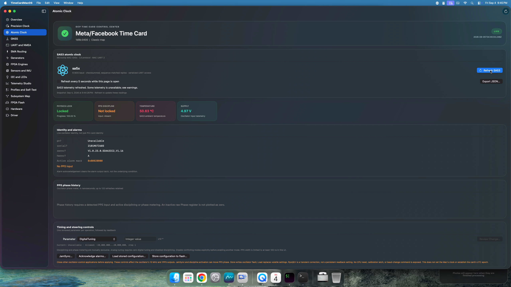
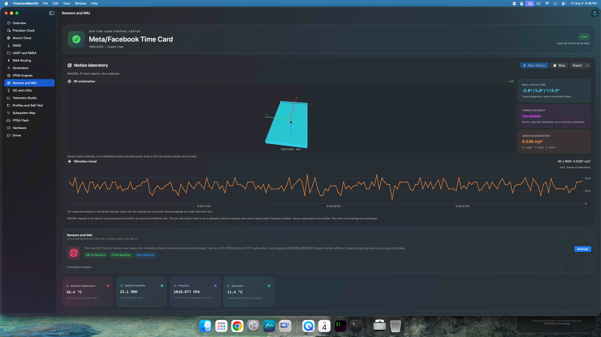
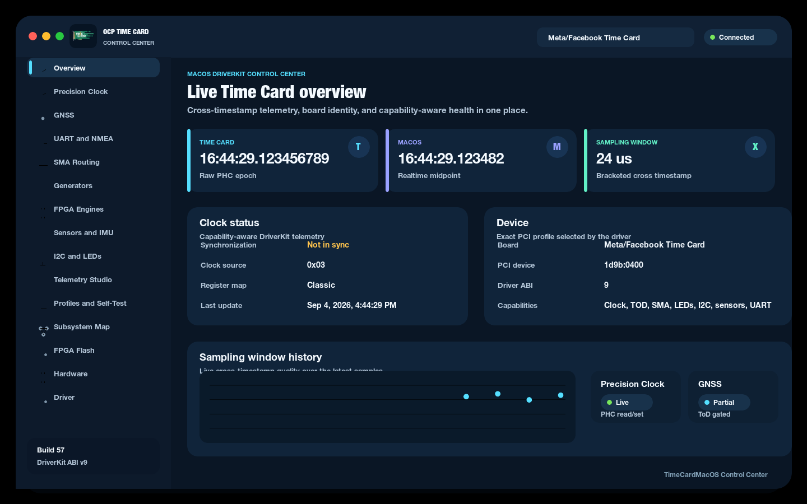
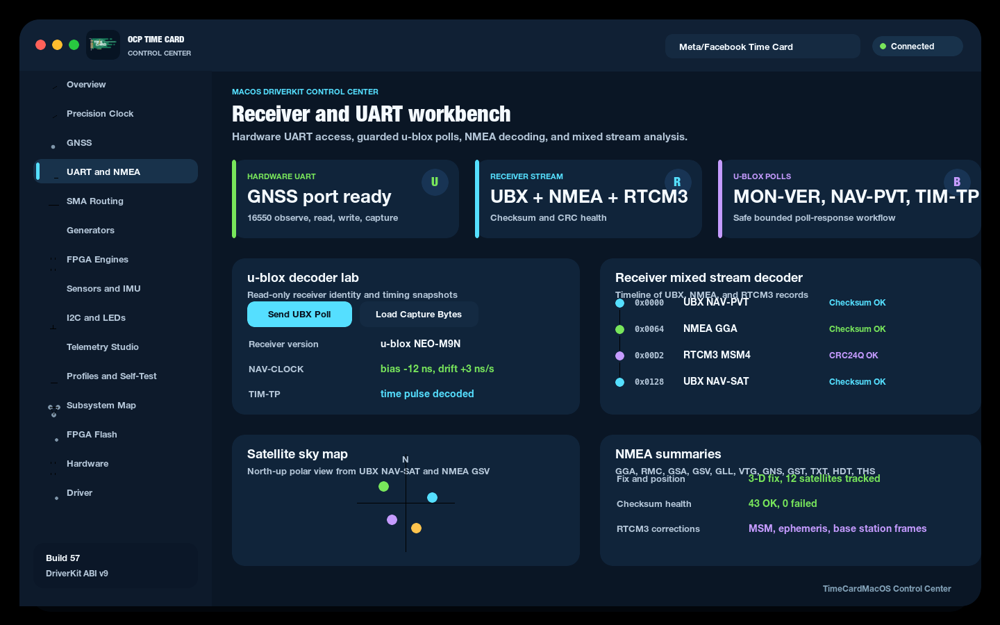
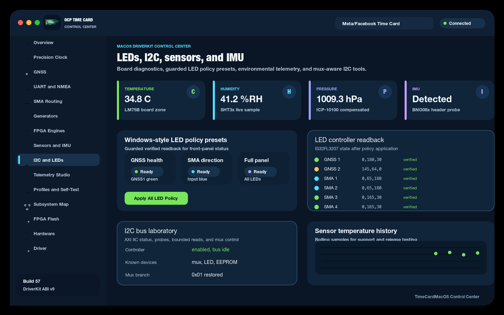
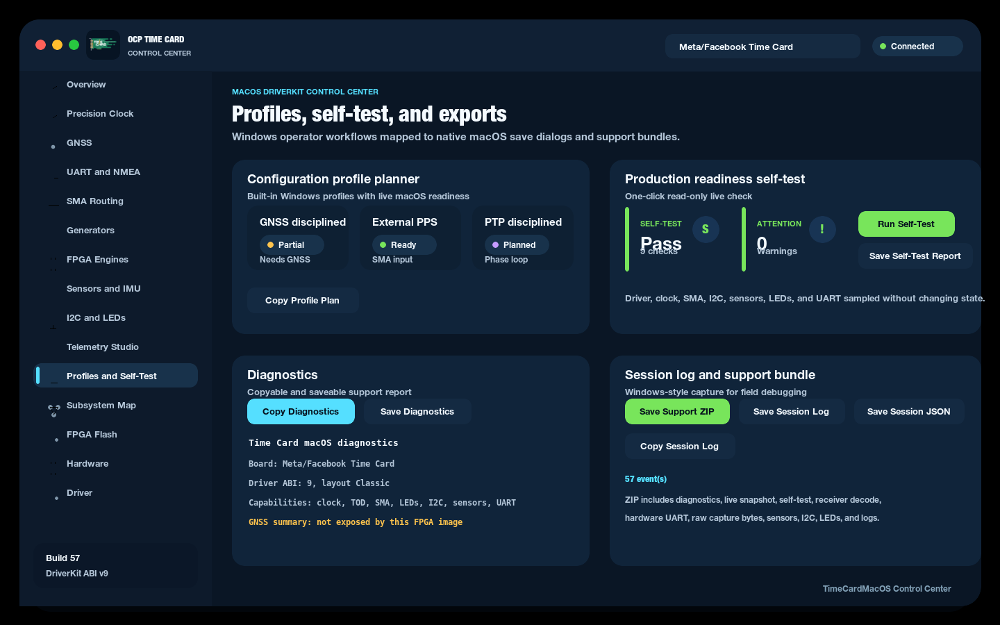

# OCP Time Card for macOS

This repository contains the native macOS driver and Control Center for the OCP
Time Card. It uses PCIDriverKit, packages the driver in a SwiftUI monitoring
app, and provides a small command-line diagnostic client.

## Screenshots

Representative macOS Control Center screenshots:

Build 65 on the Intel Mac Pro, with real SA53 and BNO08x telemetry:

| SA53 atomic clock | Live 3D orientation and vibration |
| --- | --- |
|  |  |

| Overview | GNSS and UART |
| --- | --- |
|  |  |

| LEDs and sensors | Operations and exports |
| --- | --- |
|  |  |

## Current milestone

The current implementation provides:

- Exact PCI matching and board profiles for:
  - Meta/Facebook Time Card (`1d9b:0400`)
  - Celestica R4006 (`18d4:1008`)
  - Orolia/Safran ART (`1ad7:a000`)
  - upstream Linux ADVA Time Card (`ad5a:0400`)
  - upstream Linux ADVA Time Card X1 (`ad5a:0410`)
- BAR0 discovery and per-profile bounds checking
- PCI-revision and MSI-X-signature selection of the classic and repository
  LitePCIe shifted maps
- Fixed ART and ADVA common-clock resource-map handling
- PHC time read and set operations
- Bracketed card/system cross timestamps
- Version-gated clock and TOD status reads
- Capability and field-validity reporting for absent or gated registers
- A versioned, size-checked user-client ABI v12
- Guarded clock-source query/set with supported-source masks, active-source
  readback, expected-state checks, and verified rollback on failed writes
- Four frequency counters with integration controls and error/overrun states
  on the validated Meta/Celestica revision-02 LitePCIe register layout
- Version-gated PPS input/output controls with reviewed enable, output width,
  polarity and signed cable delay changes, stale-state checks and verified
  recovery; live readouts are validated on `.141`, while hardware setting
  changes and recovery remain unverified
- SMA connector query and guarded route setting through DriverKit, including
  Linux-compatible fixed-route handling for FPGA images without writable SMA
  routing GPIO
- Board LED query and guarded RGB LED setting for the SMA LEDs through the
  Time Card I2C LED controller
- GNSS LED policy application through `timecardctl`, using ToD GNSS telemetry
  when valid and a clock-sync fallback while the exact GNSS image contract is
  still unavailable
- Safe I2C diagnostics through DriverKit: AXI IIC status, zero-byte address
  probes, bounded reads, and guarded mux query/set
- Optional ToD telemetry summary reads for UTC status, leap status, GNSS fix,
  and satellite counts when the active FPGA image exposes that register span
- Environmental sensor query for LM75B board temperature sensors, SHT3x
  humidity/temperature, ICP-10100 pressure/temperature with CRC and OTP
  compensation, plus BNO08x SHTP-header and BNO055 identity probes
- Bounded 16550 UART observe, baud-rate configure, read, and write operations
  for GNSS, GNSS2, MAC/atomic-clock, and NMEA ports on profiles that expose the
  UART register bank
- A native SwiftUI Control Center with:
  - a Time Synchronization workspace with continuous bounded GNSS observation,
    UTC/GPS/leap-second consistency checks, exact UTC/TAI epochs, monotonic
    freshness and evidence export. System-clock steering remains disabled
    until PHC epoch association and exclusive ownership are implemented and
    validated; see [Trusted time](docs/TRUSTED-TIME.md)
  - driver activation, update, and removal
  - live card discovery and explicit multi-card selection
  - PCI identity, board profile, register-map, BAR, and capability views
  - raw card time, clock status, ToD status, UTC/leap summary, GNSS fix
    summary, satellite counts, and cross-timestamp telemetry
  - live SMA connector status and route controls when the active FPGA image
    exposes writable routing
  - live Sensors and IMU workspace with environmental metric cards, board
    temperature zones, pressure compensation, temperature history, raw sensor
    inventory, BNO055/BNO08x fused motion, quaternion-driven 3D orientation,
    calibration status, low-rate vibration trends, and motion CSV/JSON export
  - a dedicated SA53 atomic-clock workspace with identity, lock/PPS/alarm
    telemetry, checksummed C3 transactions, bounded confirmed setters, mode
    conflict checks, readback, and reviewed JamSync/load/store/acknowledge actions
  - a Time Card hardware UART workspace for port selection, baud-rate
    configuration, non-draining line-status observation, bounded reads, guarded
    UBX poll writes, bounded poll-response capture, continuous polling capture
    with live progress, copy and raw capture export helpers, handoff into the
    NMEA and UBX decoder labs, a mixed UBX/NMEA/RTCM3 receiver timeline, and
    receiver summary rollups for firmware, fix, satellites, timing, position,
    RTCM3 correction names, a satellite sky map, and per-satellite signal
    records
  - NMEA summaries for GGA, RMC, GSA, GSV, GLL, VTG, GNS, ZDA, GST, TXT, HDT,
    and THS receiver sentences
  - read-only UBX polls and summaries for receiver version, monitor hardware,
    navigation status, PVT, DOP, receiver clock, GPS/UTC/leap-second time,
    satellite records, survey-in, and time-pulse telemetry
  - a read-only Windows built-in profile planner for GNSS disciplined,
    External PPS, PTP disciplined, NMEA service, and lab timing output profiles,
    with live macOS readiness and support-bundle export
  - editable, versioned JSON configuration profiles with capture, import/export,
    live change preview, confirmed apply, per-setting readback, guarded rollback,
    recovery profiles, and machine-readable apply reports
  - a native SwiftUI subsystem topology diagram that maps PCIe, DriverKit, PHC,
    macOS service, GNSS, ToD, SMA, I2C, sensors, LEDs, and FPGA cores against
    live capabilities
  - an FPGA core readiness matrix that mirrors the Windows FPGA Engines catalog
    and exports live, ready, ABI-needed, and roadmap state to support bundles
  - a receiver validation checklist for the Windows GNSS workflow, covering
    MON-VER, NAV-PVT/NAV-STATUS, NAV-SAT/GSV, NAV-TIMELS, TIM-TP, NMEA health,
    and RTCM3 correction CRC status
  - polished Windows-style LED policy preset cards for GNSS health, SMA
    direction, and full front-panel status, with guarded verified readback
  - a board-variant compatibility matrix for Meta/Facebook, Celestica R4006,
    Orolia/Safran ART, ADVA, and ADVA X1 profiles, also exported in support ZIPs
  - a rolling bracketed sampling-window chart
  - clock-source selection with confirmation in Precision Clock and Generators,
    plus capability-gated frequency cards and timing snapshot JSON export
  - an interactive Telemetry Studio with one-hour bounded history, selectable
    time ranges, sampling-window median/p95/p99 and histogram, valid ToD GNSS
    satellite history, per-sensor temperature charts, point inspection, and
    display pause that leaves collection running
  - session recording of up to 21,600 observations, independent of the visible
    chart range, with CSV/JSON export and explicit stop on card changes
  - a serial receiver console with protocol/search/checksum filters, display
    pause, selectable capture source, ASCII/hex/decimal/binary inspection,
    offline binary/NMEA replay up to 16 MiB, and TXT/CSV/JSON message exports
    plus complete raw binary export
  - receiver summary and satellite sky-map inspection for replay files, bounded
    decoding (20,000 messages), and GSV epoch replacement to prevent duplicate
    satellite markers in longer captures
  - remembered workspace selection, Command-R refresh, and direct workspace
    launch using `--page=uart`, `--page=telemetry`, or another workspace name
  - native save dialogs for telemetry JSON/CSV, diagnostics, self-test
    reports, and session-log text/JSON, plus support ZIP session-log JSON
  - clear user-client entitlement and restart diagnostics
- `timecardctl` commands for `status`, `get`, `set-card-from-system`, `sma`,
  `clock-control`, `clock-source`, `frequency`, `frequency-set`,
  `sma-set`, `led`, `led-set`, `led-sma-auto`, `led-gnss-auto`, `led-auto`,
  `i2c-status`, `i2c-scan`, `i2c-read`, `i2c-mux`, `sensors`,
  `uart-observe`, `uart-config`, `uart-read`, `uart-capture`,
  `uart-write-hex`, and `ubx-poll-read`, including BNO08x SHTP-header and
  BNO055 chip-ID probe detail

The common PHC block is available on every matched profile. ART uses its own
fixed layout and has no standard TOD block, so the driver never reads one.
ADVA profiles use the fixed common clock/TOD addresses published by current
upstream Linux, independent of their interrupt capability. The UTC, leap,
GNSS, and satellite telemetry registers are synthesis-optional. The driver
reads them only when the mapped BAR covers the optional ToD telemetry span and
marks each field valid independently.

Current upstream Linux defines the classic Meta/Celestica map and the fixed ART
and ADVA maps. The shifted revision-02 map comes from this repository's
LitePCIe gateware and Windows/Linux support; it is not currently in upstream
Linux. The Meta/Facebook classic profile is hardware-validated on an Intel Mac
Pro, including ABI v10 status, clock-source query and no-write/stale-state
setter checks, SMA fixed-route readback, SMA/GNSS LED policy
application, I2C diagnostics, optional ToD GNSS/UTC summary telemetry,
LM75B/SHT3x/ICP-10100 environmental sensor telemetry with compensated
ICP-10100 pressure, bounded UART observe/configure/read smoke checks on all
four Time Card UART ports, and bounded UART write smoke checks on the primary
GNSS receiver port. BNO08x SHTP-header probing is wired for the Celestica mux
route and reported separately from decoded fused motion.
Every other profile is covered by host-side layout and safety tests but still
requires physical-card validation before a production release.
Celestica cards programmed with the generic Meta PCI identity continue to
receive safe common-PHC support, and their environmental sensor population is
auto-probed by mux branch rather than relying only on PCI identity.

## Project layout

```text
App/       SwiftUI Control Center and driver lifecycle manager
CLI/       timecardctl diagnostic client, packaged as a macOS app
Driver/    PCIDriverKit extension and user client
Shared/    Stable C ABI and hardware register definitions
Tests/     Register-map, safety, bundle, and Swift model tests
```

## Configuration profiles

App build 63 adds **Configuration profiles** in **Profiles and Self-Test**.
Capture Current reads the selected card twice, then stages supported clock-source,
SMA-route, and frequency-integration settings. Import JSON and editing only alter
the draft. Save JSON keeps it across app restarts; unsaved drafts and reports
otherwise remain in memory. The version-1 macOS JSON format is not Windows XML compatible.

Build 65 adds a persistent **Saved profile library**. Save New Snapshot stores
an immutable copy in `~/Library/Application Support/org.opentimeserver.timecard.macos/Profiles`.
Duplicate names create separate snapshots, not overwrites. Select an entry and
Stage for Review, then preview against the connected card before applying.
Loading never changes hardware. Removal requires confirmation and moves the
entry to Finder Trash. The library supports up to 200 bounded JSON files and
isolates corrupt entries without hiding valid profiles.

Preview Changes checks the current card's PCI identity, revision, board profile,
register layout, clock version, and advertised capabilities. Fixed routes and
unsupported sources are blocked. Profiles are reusable across matching cards,
not bound to a unique serial number or exact bitstream hash. Files are limited
to 64 KiB and reject unknown fields, duplicate settings, and out-of-range values.

Apply Reviewed Profile requires confirmation and a matching preview less than
two minutes old. It rechecks live state before and after each change, applies SMA
and frequency settings before the clock source, and records attempted and verified
settings separately. On failure, it restores only identifiable changes in reverse
order. Unknown or externally changed state is preserved and reported as requiring
manual recovery. Save Report and Save Recovery Profile retain recovery evidence;
Review Recovery stages the saved baseline for a new preview, never an automatic write.

Close other card-control applications before applying. This is a recoverable
sequence, not a hardware-atomic transaction. Clock and frequency setters use
driver-level expected-state checks; SMA has app-side checks and readback only.
ART routes remain capture-only until its route capability mask is exposed by
the ABI. Profiles do not set PHC epoch, macOS time, GNSS configuration, LEDs,
oscillator settings, or flash. Support bundles include valid staged profiles and
the last apply report, or validation diagnostics for an invalid draft.

## SA53 atomic clock and IMU motion

App build 65 introduced driver 27 (ABI v11) and CLI 22. **Atomic Clock** works
with ABI v9 or later on the Meta/Celestica MAC UART at 57,600 baud. Refresh
identifies the oscillator before exposing settings. Unsupported firmware
fields remain unavailable. Clock-changing actions require confirmation,
fresh serial identity, parameter bounds and mode checks, and readback.
Timed-out writes are never automatically retried or phase-rolled-back.
Close other oscillator-control applications before applying changes.

**Sensors and IMU → Start Motion** requires the ABI v11 driver actually bound
to the PCI card, not merely listed as activated. It enables volatile BNO08x
reports or BNO055 NDOF fusion on the known Meta/Celestica sensor routes. The
3D sensor-frame schematic follows valid quaternions; grey geometry means
orientation is unavailable. Missing or stale axes do not become zero values.
The vibration chart shows gravity-compensated acceleration magnitude and
60-second RMS, with bounded history and CSV/JSON export. Times are host receive
times. Requested BNO08x report rate is 4 Hz; actual throughput depends on the
sensor and bus. This is a low-rate motion trend, not a calibrated vibration
analyzer or high-frequency spectral measurement. Stop before closing the app
to disable BNO08x subscriptions; BNO055 fusion mode is retained.

The SA53 fitted in `.141` returned valid identity and telemetry during read-only
hardware testing. It reported atomic lock but no PPS input or disciplining
lock, with alarm `0x00020000`. No oscillator settings were changed. Its older
firmware rejected eight optional queries, which are shown as unavailable.
The approved restarts completed driver replacement on `.141`; the bound driver
27 now returns ABI v11 and matches the bundled executable. Live BNO08x tests
returned full quaternion and linear acceleration in 39 of 40 polls, with one
startup sample lacking those components. The 3D view, vibration chart, Stop,
and a populated CSV export were verified on the remote desktop. Calibration
quality remains low, so orientation is explicitly marked unreliable.
See [validation and protocol details](docs/PERIPHERALS.md) and the
[build 65 validation record](docs/BUILD65-VALIDATION.md).

## Clock sources and frequency counters

Build 66 bundles driver 28 / ABI v12 and CLI 23. **Generators → PPS timing
engines** adds version-aware input/output state, pulse width, polarity, signed
cable delay, error status, a confirmed editor, and readback/rollback protection.
`timecardctl pps [1|2]` queries the engines without changing settings. The new
PPS readout path is verified on `.141` with driver 28 actually bound after the
approved restart: both cores report version 1.2.0, output width 100 ms, and input
width 80 ms. Setting changes and physical pulse accuracy remain unverified.
See [PPS-ENGINES.md](docs/PPS-ENGINES.md) for the exact
version gates, safety behavior, test scope, and deployment state.

Clock-source and frequency controls require driver build 25 (ABI v10) or
later. Older ABI v7-v9 drivers remain usable for their existing features;
unsupported controls stay disabled.

**Precision Clock** and **Generators** show the configured source separately
from the active input. Source changes require confirmation, preserve the PHC
time and control register, reject a stale expected source, and verify readback.
If readback fails, the driver restores and verifies the previous setting. A
rollback verification failure is reported explicitly. Selecting a source does
not guarantee that the corresponding reference signal is connected or locked.
NTP, SyncE, and Dynamic remain gated on exact-image synthesis contracts. DCF
requires clock core v1.8 or newer. No macOS system-time setting is performed.

Frequency counters have four channels, 1-255 second integration, and an explicit
zero-second disable setting. Valid, waiting, disabled, error, and overrun states
are distinct. Counter controls do not change SMA routing or enable generators.
Original classic FPGA block designs omit these versionless cores, while the
repository's revision-02 LitePCIe block design includes all four. Accordingly,
classic/ART/ADVA counter addresses are not probed without an exact-image presence
contract. LitePCIe counter operation still requires physical-card validation.

```sh
timecardctl clock-control
# Explicit source changes can interrupt downstream synchronization:
timecardctl clock-source 3 3   # PPS expected; already-PPS is a no-write check
timecardctl frequency         # Unsupported images are rejected without probing
timecardctl frequency-set 1 10
timecardctl frequency-set 1 0  # Disable counter 1
```

The source mask uses bits 0-6 for source IDs 0-6, bit 30 for Registers (0xfe),
and bit 31 for External (0xff). New selectors 18-21 append to the existing ABI;
all prior structure sizes and selectors are unchanged. Timing JSON exports
include PCI identity, service ID, ABI, register layout, raw control/status,
decoded fields, and availability/errors. Raw valid bits must be interpreted
together with enabled/error/overrun flags before using a frequency value.

## Receiver console and telemetry sessions

Open **UART and NMEA** to use the receiver console. Select a hardware capture,
hardware read, macOS serial preview, or decoder input as the source. **Replay
File** loads raw binary or NMEA text without transmitting it. Replay has its
own source label; **Return to Live** resumes inspection of the selected live
source. **Pause Display** freezes the console while an active bounded capture
continues. Protocol, checksum, and search filters affect the table and decoded
exports. Binary export always preserves the full retained capture, including
noise and incomplete frames. The table shows up to 500 matching messages and
the raw preview shows up to 4 KiB; decoded exports include all matching messages
up to the 20,000-message decoding limit.

In **Telemetry Studio**, select a one-minute to one-hour view and click or drag
on a chart to inspect a sample. Pausing charts does not stop collection or
recording. **Start Recording** retains up to 21,600 observations independently
of the chart window. Recordings remain in memory until exported and stop when
the active card changes. CSV uses UTC host timestamps and blank cells for
missing readings; JSON preserves the measurement types and recording metadata.
No UTC/TAI offset is inferred from raw card time.

Direct workspace launch:

```sh
open -a TimeCardMacOS --args --page=telemetry
open -a TimeCardMacOS --args --page=uart
```

Launch arguments apply when the application starts. Use the sidebar to switch
workspaces when the app is already running.

See [Windows parity status](docs/WINDOWS-PARITY.md) for implemented features
and the remaining driver and hardware milestones.

## Build and test without signing

Run the portable driver tests, build the CLI, and run the Swift Control Center
model tests:

```sh
make check
```

On macOS, CMake places the executable in the unsigned wrapper at
`.build/cmake/timecardctl.app/Contents/MacOS/timecardctl`. The wrapper gives
the diagnostic client a bundle identifier and a place for its development
provisioning profile.

Build the same unsigned CLI app with Xcode:

```sh
xcodebuild \
  -project TimeCardMacOS.xcodeproj \
  -scheme timecardctl \
  -configuration Debug \
  -derivedDataPath .build/xcode-cli \
  ARCHS=x86_64 \
  ONLY_ACTIVE_ARCH=NO \
  CODE_SIGNING_ALLOWED=NO \
  build
```

The equivalent convenience command for the Intel Mac Pro build is
`make build-cli-app ARCHS=x86_64`.

Compile the complete app and DriverKit extension without installing them:

```sh
xcodebuild \
  -project TimeCardMacOS.xcodeproj \
  -scheme TimeCardMacOS \
  -configuration Debug \
  -derivedDataPath .build/xcode-app \
  ARCHS=x86_64 \
  ONLY_ACTIVE_ARCH=NO \
  CODE_SIGNING_ALLOWED=NO \
  build
```

The equivalent convenience command for the Intel Mac Pro build is
`make build-app ARCHS=x86_64`. It also checks that the embedded extension is
named `org.opentimeserver.timecard.macos.driver.dext`. DriverKit requires the
DEXT filename, without the `.dext` suffix, to exactly match its bundle
identifier.

An unsigned build validates the Swift, C, C++, IIG, linking, plist, and bundle
layout. It cannot activate the system extension.

## Signing requirements

Before installing the driver, configure one Apple development team for all
three targets and request these capabilities from Apple:

- DriverKit
- DriverKit PCI Transport
- System Extension installation
- DriverKit user-client access

For macOS clients, request
`com.apple.developer.driverkit.userclient-access` through Apple's System
Extension or DriverKit entitlement form. Set **UserClient Bundle IDs** to
`org.opentimeserver.timecard.macos.driver`. The portal capability named
**DriverKit Communicates with Drivers** is for iPadOS and does not authorize
the macOS user-client entitlement. A development host can activate and bind
the DEXT without user-client access, but client commands cannot open the
DriverKit user client until Apple grants it and replacement profiles include
the entitlement.

The development DriverKit PCI profile authorizes Apple's wildcard
`IOPCIPrimaryMatch` value. Use that value only in development signing
entitlements. `Driver/Info.plist` remains restricted to the supported Time
Card PCI identifiers at runtime. When manually signing development builds,
extract the entitlement dictionary from the provisioning profile and sign the
DEXT with that profile-derived plist. A minimal hand-written DriverKit
entitlement file can pass `codesign` but still fail DriverKit's authenticated
open path when macOS stages the system extension.

A distribution DriverKit profile must authorize every PCI primary match that
will ship. Keep the entitlement and runtime personality synchronized with this
exact list:

```text
0x04001d9b 0x100818d4 0xa0001ad7 0x0400ad5a 0x0410ad5a
```

The build tests extract and compare the single `IOPCIPrimaryMatch` value in
each file against the canonical match set in `Shared/TimeCardRegisters.h`.
Extra matches, wildcards, and missing values fail the test. Using the primary
match key also prevents subsystem IDs with the same encoded value from entering
the runtime match set.

The configured identifiers are:

```text
org.opentimeserver.timecard.macos
org.opentimeserver.timecard.macos.driver
org.opentimeserver.timecard.macos.cli
```

Change them consistently if the approved App IDs use a different prefix.
The signed CLI bundle uses `CLI/timecardctl.entitlements`; place its matching
development provisioning profile at
`timecardctl.app/Contents/embedded.provisionprofile` before signing.

For repeatable development installs, the host app accepts
`--activate-driver`. Launching `/Applications/TimeCardMacOS.app` with this
argument submits the DriverKit activation or replacement request for the
embedded `org.opentimeserver.timecard.macos.driver` extension. macOS may still
require approval in System Settings or a reboot before the PCI service binds to
the new driver build.

## First hardware bring-up

1. Verify the card and gateware on Linux using `ptp_ocp`.
2. Install the card in a Mac Pro or a compatible Thunderbolt PCIe chassis.
3. Confirm that macOS enumerates the expected PCI vendor and device ID.
4. Build and activate the signed host app.
5. Approve the extension in System Settings if prompted.
6. Confirm activation with `systemextensionsctl list`.
7. Open the Control Center and verify that the Overview, Precision Clock, and
   Hardware pages show the selected card.
8. Run `timecardctl.app/Contents/MacOS/timecardctl status`, followed by the
   same executable with `get`, `sma`, `led`, `led-auto`, `i2c-status`,
   `i2c-scan`, `i2c-read`, `i2c-mux`, `sensors`, `uart-observe`,
   `uart-config`, `uart-read`, `uart-capture`, `uart-write-hex`, and
   `ubx-poll-read mon-ver|mon-hw|mon-hw2|nav-status|nav-pvt|nav-dop|nav-clock|nav-timegps|nav-timeutc|nav-timels|nav-sat|nav-svin|tim-tp`.
9. Compare the reported card time, core versions, and available status fields
   with the Linux reference setup.

Do not use `set-card-from-system` until read-only status and time access have
been validated on the target card. This command copies raw macOS
`CLOCK_REALTIME` seconds into the card. It does not set the macOS system clock,
and it does not yet apply a UTC/TAI correction.

## Known limitations

- Cross timestamps currently bracket the MMIO clock read with macOS realtime
  samples. PCIe PTM support is not implemented.
- UART interrupt-backed streaming, PPS interrupts, external timestamp inputs
  beyond SMA route readback, arbitrary raw I2C writes, SPI flash, and signal
  generators are not implemented. Frequency counters are gated to the
  revision-02 LitePCIe contract described above.
- I2C support intentionally exposes diagnostics, probes, bounded reads, and mux
  control only. General writes remain gated until the Control Center has device
  profiles, paging rules, and write-safety warnings.
- Sensor support reports LM75B, SHT3x, ICP-10100 telemetry with compensated
  pressure when OTP calibration is available, plus BNO08x/BNO055 motion with
  ABI v11. BNO08x motion is physically validated on `.141`; BNO055 and other
  board variants still require hardware validation.
  BME/BMP280 and INA219 rail telemetry remain planned. ART/ADVA IMU routes
  and ART mRO-50 oscillator support remain gated.
- SMA routing is implemented for the classic, shifted LitePCIe, ART, and ADVA
  register maps. FPGA images with absent or fixed route GPIO report fixed
  direction and fixed function, and writable changes are rejected.
- SMA LED policy is implemented for boards that use the Xilinx AXI IIC LED
  controller path: Meta/Facebook, Celestica/R4006, ADVA, and ADVA X1. ART LED
  support remains disabled until its OpenCores I2C path is ported.
- GNSS LED policy currently uses raw ToD GNSS telemetry when the driver marks
  those fields valid. Otherwise GNSS1 falls back to the card clock sync bit,
  and GNSS2 reports status unknown unless a future second-receiver source is
  added.
- Optional UTC, leap, GNSS, and satellite registers are guarded by BAR span and
  validity bits. Receiver stream preview is available through bounded UART
  reads when the FPGA exposes 16550 ports. Safe UBX poll writes are available
  through the UART workspace. The decoder can show mixed UBX, NMEA, and RTCM3
  receiver traffic, validate RTCM3 CRC24Q checksums, summarize stream checksum
  health, report RTCM3 correction message types, and summarize UBX NAV-SAT and
  NMEA GSV satellite records in a sky map and signal table, while
  interrupt-backed continuous streaming and guarded persistent u-blox
  configuration remain planned.
- The Control Center labels card time as raw and does not calculate a card to
  macOS offset until the driver exposes a trusted UTC-to-TAI contract.
- The driver does not create a Linux-style `/dev/ptpN` device.
- No daemon currently disciplines the macOS system clock.
- `timecardctl` refuses ambiguous access when multiple cards are present;
  explicit per-card selection is not implemented yet.
- Sleep, wake, Thunderbolt disconnect, all non-Meta profiles, and multiple-card
  behavior require physical hardware testing.

See [ROADMAP.md](docs/ROADMAP.md) for the staged implementation plan.
