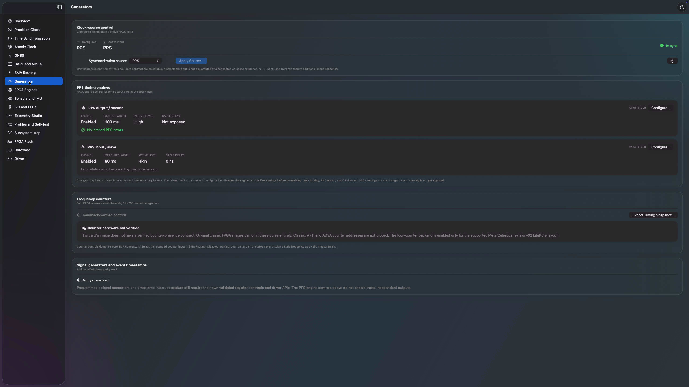

# PPS engines, build 66

Build 66 adds native PPS input/output configuration to the Generators page,
with driver 28 / ABI v12 and CLI 23. This controls the FPGA PPS engines, not the
SA53 oscillator. It does not reroute SMA connectors, set the PHC epoch, or
change macOS time.

The same driver contract remains active in app 67. Its current Generators
page is shown below; this is a readback capture, not a physical output test.

## Register contract

The Meta/Celestica classic and revision-02 LitePCIe block designs map PPS
master/slave at `0x01030000`/`0x01040000` and
`0x03030000`/`0x03040000`, respectively. The BAR span is checked before the
version register is read. ART and ADVA paths are rejected without register
access. The capability bit means the version-query path is available, not
that every field is present or physically validated.

Only NetTimeLogic core versions 1.0 through 1.6 use the implemented field
contract. Zero, all-ones, open-source 0.1, and other unrecognized versions
return their version with no valid or writable fields. The open-source 0.1
PPS generator has different synthesis and pulse-width semantics, so it must
not be treated as the commercial 1.x core.

| Field | Output / master | Input / slave |
| --- | --- | --- |
| Enable | 1.0+ | 1.0+ |
| Pulse width | 1.0+, writable 1...999 ms | 1.0+, measured and read-only |
| Polarity | 1.1+ | 1.2+ |
| Status | 1.2+ | 1.3+ |
| Cable delay | 1.4+ | 1.0+ |
| Delay magnitude | 65,535 ns before 1.6; 1,073,741,823 ns at 1.6 | Same |

Cable delay uses sign bit 31 and a version-specific magnitude mask, preserving
other bits. Raw width zero or values above 999 are displayed as unavailable,
not as a measured zero. Disabled engines are explicitly labelled; their
register readbacks do not prove an active output. Unknown status bits are
retained in the UI. Error acknowledgement is not exposed in this release.

Primary repository references:

- `DRV/Windows/fpga.c`, `TimeCardPpsQueryLocked` and `TimeCardPpsSet`.
- `DRV/Windows/timecard.h`, `TIMECARD_PPS_REG` and PPS map offsets.
- `FPGA/Open-Source/Implementation/Xilinx/TimeCard/Bd/TimeCardBd.tcl`.
- `FPGA/Open-Source/Implementation/Xilinx/TimeCard_LitePcie/Bd/TimeCardBd.tcl`.
- `FPGA/Open-Source/Ips/PpsGenerator/PpsGenerator.vhd` and
  `FPGA/Open-Source/Ips/PpsSlave/PpsSlave.vhd` for the distinct 0.1 contract.

## Safe configuration

Configure opens a captured baseline. Only supported fields are editable;
the final confirmation lists old and requested values. The app rejects
invalid numeric input, card changes, and confirmations older than two minutes.

The 64-byte setter request contains the expected core version and raw
persistent register values. The driver serializes the whole transaction,
rejects stale state, preserves reserved bits, and performs no writes when
settings already match. Measured input pulse width and transient status do
not cause false stale-state failures. Configuration never clears latched errors.

Before modifying parameters, the driver disables the engine and verifies the
disabled state. It verifies parameters before restoring the requested enable
state and then reads the full snapshot again. If verification fails, it restores
parameters while disabled. It never deliberately re-enables the engine unless
the restored parameters verify. A failed recovery is explicitly reported and
can leave the engine disabled. Readback proves register configuration, not
physical pulse accuracy or that a synthesis option is connected.

ABI v12 appends selector 23 (16-byte query, 48-byte response) and selector 24
(64-byte setter, 48-byte response). Existing selectors and structures are
unchanged. The app includes PPS snapshots in timing JSON export and adds
version-aware read-only self-test checks. `timecardctl pps [1|2]` only reads.

## Validation and deployment

Seven CMake/CTest suites and six Swift suites pass. PPS tests cover field
version gates, unsupported boards and short BARs, no-access rejection,
signed-delay limits, malformed requests, preserved bits, no-write idempotence,
stale state, changing input measurements/status, disabled-before-write ordering,
read/write failures, rollback, and fail-disabled recovery. Swift tests cover binary layout, unavailable
measurements, field validation, and unsupported firmware. Universal Intel and
Apple Silicon builds, bundle checks, and strict signatures pass.

App 66 and CLI 23 are installed on `192.168.1.141`. Before the restart, remote
GUI checks confirmed the build 66 Generators page showed the ABI v12
requirement without offering unavailable PPS controls. The saved profile
library retained its existing entry. The read-only self-test completed with
13 passed checks, two gated checks (PPS and frequency counters), and no
warnings or failures. Installed app and bundled driver hashes match the
locally signed artifacts below.
The exported report was independently read over SSH and retained locally at
`DRV/MacOS/.build/timecard-build66-self-test.txt`.

### Approved restart and live validation

On September 4, 2026 (America/Los_Angeles), one approved restart activated
driver 28. The actual PCI-bound service now returns ABI v12, and the running
extension executable matches the bundled driver hash below. SSH and Screen
Sharing returned, and app 66 reopened successfully.

Repeated CLI and populated GUI readouts confirmed:

- PPS output/master: core 1.2.0, enabled, active high, 100 ms output width,
  no latched errors. Cable-delay configuration is not exposed by this version.
- PPS input/slave: core 1.2.0, enabled, active high, 80 ms measured width,
  zero cable delay, maximum magnitude 65,535 ns. This version does not expose
  input error status; absence of that field is not evidence of no input errors.
- Output editor: unchanged configuration cannot be reviewed; 1,000 ms is
  rejected; a 99 ms draft showed the 100-to-99 ms confirmation and interruption
  warning. Both confirmation and draft were cancelled. Subsequent hardware
  reads still returned 100 ms output width and unchanged PPS configuration.

The configured and active clock source remained PPS (3). Clock status was
initially not in sync after reboot and returned to 1 (in sync) by the five-minute
uptime check. UTC validity remains false, so this does not establish a valid
UTC epoch. All five environmental sensor blocks, all four SMA routes, all six
LED readbacks, the I2C controller, and non-draining GNSS UART observation worked.

The signed peripheral smoke client was rebuilt against ABI v12. SA53 queries
reported atomic lock, 50.075 C, and 4.968 V. The pre-existing absent PPS input,
unlocked disciplining state, and eight unsupported optional queries remain.
The BNO08x test received quaternion and linear acceleration in 38/40 polls,
with two startup polls lacking these components. It stopped volatile reports
and restored the mux to zero. The JSON evidence is retained at
`DRV/MacOS/.build/timecard-motion-build66.json`. Sensor fusion accuracy remains
unreliable, and these low-rate samples are not calibrated vibration analysis.

No PPS setter, clock-source setter, SA53 setting command, PHC epoch change,
flash operation, or macOS time change was performed. Input-editor interaction,
the post-reboot GUI self-test/export, and setter/no-op/rollback execution on
physical PPS hardware remain unverified. GUI automation stopped when the user
began operating the app. No production-release or full Windows-parity claim
follows from these checks.

Prior app 65 and CLI 22 are retained under
`/Users/ahmad/TimeCard-Backups/build66.wiV93q/`, outside temporary storage.

| Artifact | SHA-256 |
| --- | --- |
| App 66 package | `536825e0fb7fc8c069d39b54fef7bf2a53c610b1d9b303a789bf3d54da33d546` |
| App 66 executable | `91cf23876bf860e4e83ee3971e3b5fe14fbef32bc1f585ef15a1c93919682756` |
| Bundled and PCI-bound driver 28 executable | `7a514e92e1a5df36a8dbf8d66e9c2a32d4b5aa5dc4e7b0e04446abffb0e287db` |

Further physical validation requires an agreed test setup for timing changes,
independent pulse measurement, and controlled recovery tests. Do not equate an
activated extension listing with the driver that is actually serving the PCI card.
