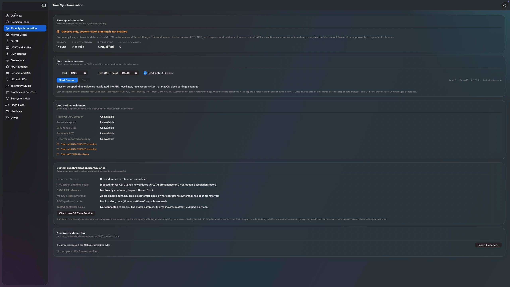

# Trusted time, app build 67

Build 67 adds a native **Time Synchronization** workspace and receiver-time
qualification. It does not yet discipline the macOS clock. Driver 28 / ABI v12
is unchanged; CLI 24 labels raw PHC reads as UTC/TAI epoch unqualified instead
of presenting them as UTC. This is a safety foundation, not full Windows parity
or a production clock service.

## Using the workspace

1. Select the connected Time Card, then open **Time Synchronization**.
2. Choose GNSS or GNSS 2 and the host UART baud. Close other card-control
   clients before starting; this app's ownership guard cannot stop external
   programs from using the same hardware.
3. Start a session. Optional read-only UBX polls request receiver identity and
   time metadata. The page shows received bytes, checksum errors, qualification
   reasons and time-service conflicts. Other manual hardware operations in
   the app stay blocked until the session stops.
4. Export evidence to save the observed state and the bounded message log.
   Exported host receive times are not precision GNSS timestamps.
5. Stop the session before returning to hardware configuration. Stop revokes
   time evidence and releases the app's hardware-operation guard.

The screenshot was captured after the validated session stopped. Its zero
received bytes and unavailable UTC/TAI values are the actual test-card state,
not example readings. No clocks are changed by this workspace.

## Implemented

- A continuous GNSS/GNSS2 polling session, limited to 24 hours and the latest
  200 messages, with Start, Stop, byte/error counters and JSON evidence export.
- Read-only MON-VER, NAV-TIMEGPS, NAV-TIMEUTC and NAV-TIMELS requests. Starting
  configures the selected host UART baud, not persistent receiver settings.
- App-level UART ownership: competing manual hardware operations are blocked
  until the worker finishes. Stop revokes evidence immediately, cancels bounded
  UART calls, and releases ownership. Card changes stop the session. External
  clients are not locked out and must be closed separately.
- Bounded streaming UBX framing, checksum/length checks, UART-error rejection,
  and monotonic reception aging that includes sleep. Imported recordings do
  not feed the live qualification path. Repeated epochs cannot renew freshness.
- UTC calendar/GPS-week agreement, exact integer seconds/nanoseconds, dynamic
  GPS-UTC and TAI-UTC offsets, broadcast-source checks, and leap-event guards.
  No guessed GPS-week rollover or hard-coded current leap offset is used.
- Correction of the NAV-TIMELS summary decoder: payload bytes 8 and 10 are
  source identifiers; the signed offset and change are bytes 9 and 11.
- A unit-tested, pure slew controller with five stable samples, a 100 ms
  offset limit, 100 microsecond uncertainty gate and 250 microseconds/second
  proposal cap. It rejects missing provenance, lost lock, stale/duplicate
  samples, phase discontinuities, card changes and missing exclusive ownership.
  It is not connected to a clock writer or precision offset stream.
- Read-only detection of Apple's `timed` process, with explicit unknown or
  competing-owner messaging. There are no `adjtime` or `settimeofday` calls,
  Network Time changes, automatic clock steps, or privileged helper installs.

The receiver must supply all three time messages within three seconds, with
adjacent navigation epochs, mutually consistent offsets and calendar epochs,
and receiver-reported accuracy no worse than one millisecond. Configured,
default and unknown leap sources do not qualify. A leap second expressed as
second 60 is rejected instead of being collapsed into a POSIX timestamp.
Qualification is withheld from 60 seconds before a reported leap event until
fresh post-event metadata is received. TAI-scale seconds use the fixed GPS/TAI
integer offset of 19 seconds plus the receiver's validated GPS-UTC offset.
This does not claim laboratory traceability to the BIPM realization of TAI.

Receiver time consistency is not cryptographic authenticity, a precision UART
arrival timestamp, or proof of the PHC epoch. Exported receive times are host
log timestamps. Receiver accuracy does not include serial transport latency.

## Hardware evidence

Checks on September 5, 2026, on the Intel Mac Pro at `192.168.1.141`:

- The bound classic Meta driver reports ABI v12, PPS source `0x03`, clock
  status `0x01` (in sync), and invalid UTC/leap metadata (`0x00000000`).
  This FPGA image does not expose the GNSS summary contract. Its running
  PHC is not a qualified UTC clock.
- Both GNSS UARTs accepted MON-VER poll writes but returned no response bytes
  at 9,600, 38,400, 57,600, 115,200 and 230,400 baud. Both host UARTs were
  restored to 115,200 baud after scanning. No receiver configuration was saved.
- No USB GNSS serial interface was enumerated. `/dev/cu.pci-serial22` belongs
  to an Intel PCI serial device, not the Time Card, and was not probed as GNSS.
- Apple Network Time is on, using `time.apple.com`, and `timed` is running.
  These settings were left unchanged.
- A fresh SA53 readback after the GNSS session stopped showed atomic lock,
  no PPS input and no disciplining lock. Neither that route nor oscillator control was
  changed by this increment. FPGA PPS lock does not prove PPS reaches SA53.

## Validation

Seven CTest suites and seven Swift suites pass. New tests include exact epoch
arithmetic, overflow, invalid calendar components, invalid UTC/GPS/leap flags,
week-rollover disagreement, adjacent epochs across a GPS week boundary,
conflicting offsets, same-epoch metadata withdrawal, stale and repeated
frames, checksum corruption, every streaming split boundary, malformed lengths,
bounded noise handling, and inhibited/bounded slew proposals.

Universal Intel and Apple Silicon app builds, bundle metadata, and strict
signature checks pass. The app embeds the exact previously signed driver 28,
not the newly compiled copy, avoiding a same-version driver replacement.

App 67 was installed and launched on `.141` without replacing the bound driver
or rebooting. The previous app is recoverable at
`/Users/ahmad/TimeCard-Backups/build67.tSMDgk/TimeCardMacOS-build66.app`.
Installed and local executable hashes match. The live GUI session sent 1,640
poll bytes with zero received bytes at export time; JSON independently read
over SSH confirms an unqualified receiver, no PHC association, no installed
clock writer and zero synchronization clock writes. SA53 Refresh was blocked
while the GNSS session owned the UART workflow. Stop restored Start and the
other hardware controls; subsequent SA53 Refresh succeeded, confirming lease
release. The live export is retained locally under
`.build/timecard-build67-live-time-evidence.json`. PPS engine readbacks remain
unchanged: output 100 ms, input 80 ms, active high, input cable delay 0 ns.
The GUI's FPGA readiness row now correctly marks the implemented PPS path as
available while keeping unimplemented engines gated.

App executable SHA-256:
`1cbdc7aeb34ec4f2e3f56a7c3139442418a317629c3601eb58f4efae1d58a0fe`.

Bundled and previously bound driver executable SHA-256:
`7a514e92e1a5df36a8dbf8d66e9c2a32d4b5aa5dc4e7b0e04446abffb0e287db`.

App ZIP SHA-256:
`6e1c54ba1664e6deefa77efee4f84e72614fd684667b8fc4772ae7d74e336037`.

CLI 24 is also installed and hash-verified on `.141`. A live `get` now labels
its 1970-looking reading `(raw PHC; UTC/TAI epoch unqualified)`. CLI 23 is
backed up alongside the previous app in `build67.tSMDgk`.

CLI executable SHA-256:
`96f0d6ac62f32d50616cdf156cf2c718f6047a6a654108cc95808fcb77614e4e`.

CLI ZIP SHA-256:
`1d82802563e45074755d5f32c8647a2046834426f7af67b38087d928c98ee8c3`.

## Remaining work and dependencies

1. Identify and restore the actual GNSS data/PPS route and confirm SA53 PPS
   reception. Do not infer wiring from FPGA frequency lock. Receiver identity
   and a card/cable inspection are needed before persistent configuration.
2. Add a versioned driver record associating a qualified GNSS epoch and time
   scale with an actual PHC/PPS capture, including sequence, freshness and
   uncertainty. Validate it against an independent reference on hardware.
3. Add independently reviewed smooth PHC adjustments and a privileged,
   authenticated, narrowly scoped system-clock service. Require explicit
   ownership transfer from Network Time, bounded correction, stop/recovery,
   sleep/wake and long-duration testing before enabling discipline.
4. Extend exact-image FPGA contracts for generators, timestamps and interrupts,
   IRIG-B/DCF/ToD configuration and version-aware PPS alarm acknowledgement.
   Existing PPS controls remain documented in [PPS-ENGINES.md](PPS-ENGINES.md).
5. Add receiver-version-aware survey/fixed-position and persistent settings,
   plus full generic serial sessions and flow control. The build 67 observation
   session is not a persistent receiver configuration facility.
6. Implement genuinely high-rate timestamped motion acquisition before FFT or
   spectral claims; validate calibration, additional sensors and ART mRO-50
   against the corresponding physical boards.
7. Extend profiles to typed newer controls and Windows XML migration. Add
   board-specific EEPROM identity and protected firmware updates only with
   verified image identity, compatibility, backup and recovery mechanisms.

## Protocol and platform references

- [u-blox 8/M8 receiver description and protocol specification, R28](https://content.u-blox.com/sites/default/files/products/documents/u-blox8-M8_ReceiverDescrProtSpec_UBX-13003221.pdf), NAV-TIMEGPS, NAV-TIMELS and NAV-TIMEUTC field definitions.
- [Apple adjtime manual](https://developer.apple.com/library/archive/documentation/System/Conceptual/ManPages_iPhoneOS/man2/adjtime.2.html), gradual clock correction and privilege requirements for future integration.
- [BIPM Annual Report 2002](https://webtai.bipm.org/ftp/pub/tai/annual-reports/bipm-annual-report/annual_report_2002.pdf), GPS time's 19-second offset from TAI.
