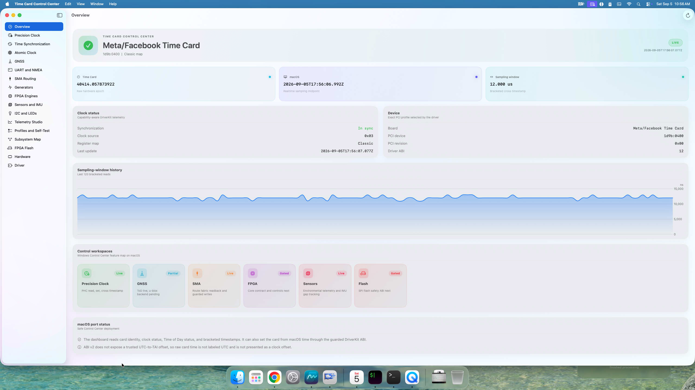
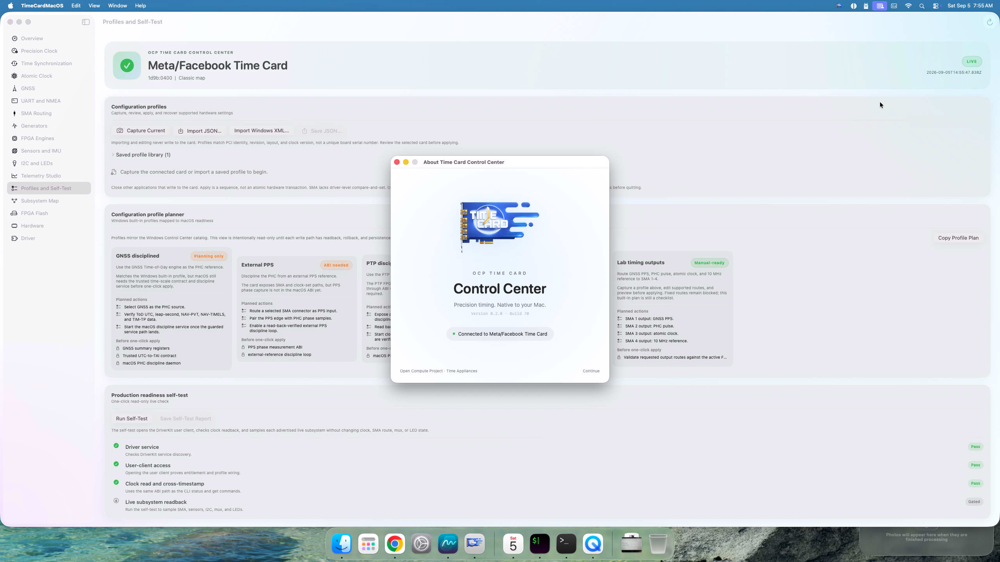
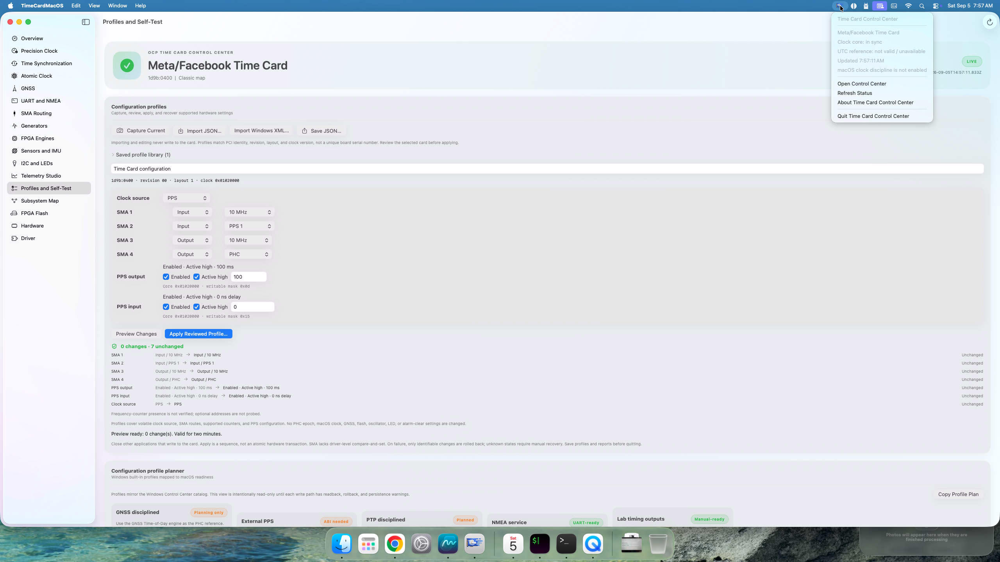
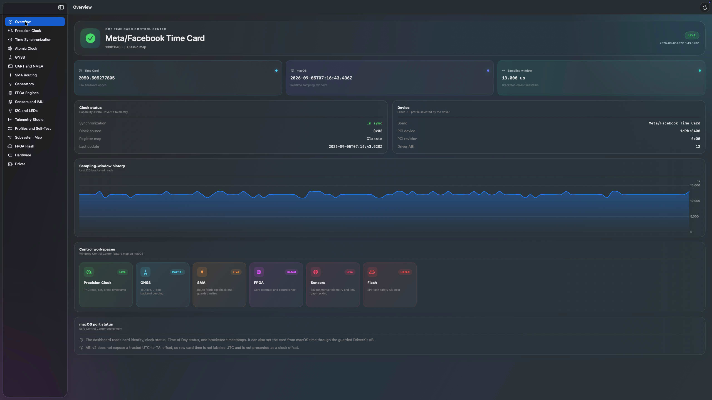
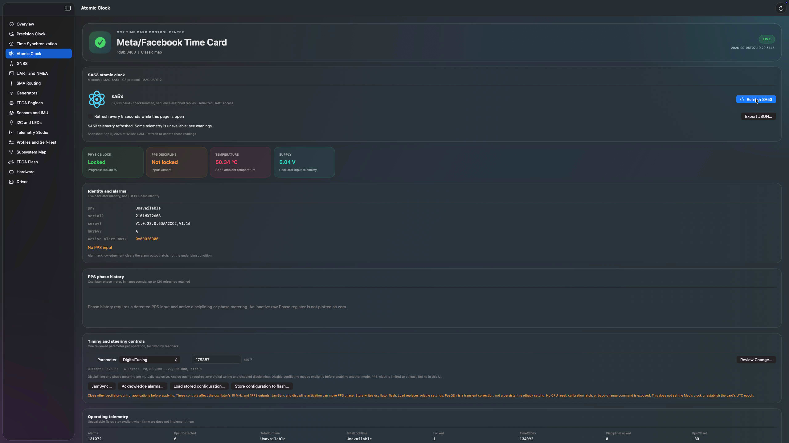
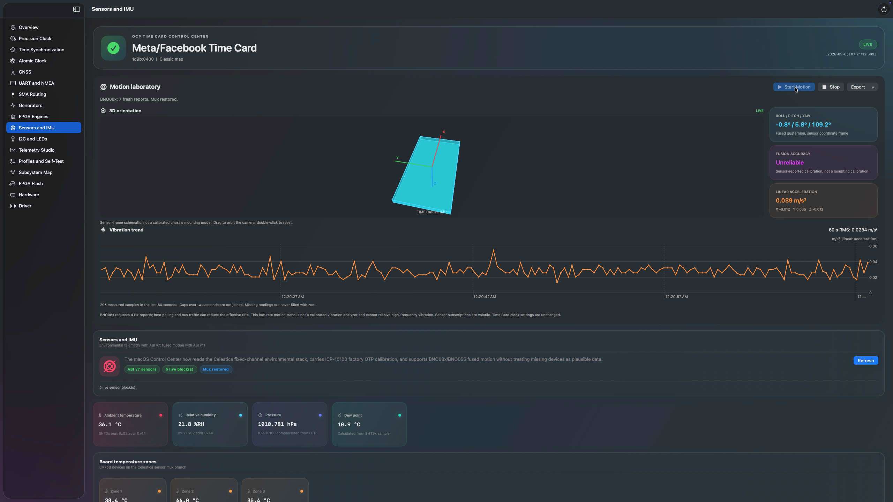

# macOS Control Center screenshots

These are unretouched, full-resolution captures of the installed SwiftUI app,
not mockups. Builds 73, 72, 71, 70 and 67 were captured on September 5, 2026, on an Intel Mac Pro
with a classic Meta/Facebook Time Card, driver 28 / ABI v12, and CLI 24.
Each current PNG is 2560 × 1440 pixels. Open an image to inspect the full size.

The captures intentionally retain unavailable fields and safety warnings.
PPS frequency lock does not establish UTC validity, and an implemented control
does not prove that every hardware variant or physical setting change has
been validated. See the [parity matrix](../WINDOWS-PARITY.md) and
[trusted-time validation record](../TRUSTED-TIME.md).

## Time Card Control Center and native menu-bar icon

Build 73 displays the Time Card Control Center name in the menu bar and app
header. It retains build 72's solid card silhouette with clock cutouts and rounded trailing
bars, following the supplied design reference. The template uses the same
monochrome tint as the other macOS status icons and has no square backing.
The Dock icon, splash and About artwork remain full color. This capture shows
the unselected icon alongside the neighboring status icons and live Overview.

## Welcome and About

Build 70's startup artwork is also available from About. This is the persistent
About window, showing the same design with version/build and live connection
status. The startup splash itself dismisses after about 2.4 seconds. The full-color
menu-bar logo in this older capture was replaced by the template above. Build 73
also removes the OCP prefix from the splash title.

## Menu-bar status and PPS profiles

Build 70 shows the borderless Time Card mark and its native status menu above
a seven-setting profile preview. Both PPS cores are included; the preview has
zero changes. The menu explicitly distinguishes clock-core lock from invalid
UTC and states that macOS clock discipline is disabled.

## Time Synchronization

Continuous GNSS observation, exact receiver UTC/TAI evidence, qualification
reasons, time-service conflict detection and evidence export. This capture is
after Stop: PHC UTC remains invalid, no GNSS bytes were received, and system-clock
steering is disabled. The unavailable values are the actual hardware state.

## Live overview

Raw PHC seconds, host sampling time, PCI identity, ABI and capability-aware
workspaces. The chart measures the host sampling window, not clock offset or
absolute time accuracy.

## PPS timing engines

The Generators page shows the real PPS 1.2 cores: output enabled at 100 ms,
input measured at 80 ms, both active high, input cable delay 0 ns. Unsupported
status/delay fields and optional counters remain explicitly gated. No PPS
settings were changed to obtain this screenshot. See the
[PPS register and validation contract](../PPS-ENGINES.md).

## SA53 atomic clock

Read-only telemetry was refreshed before capture. Atomic physics lock is
present, but PPS input is absent and PPS discipline is not locked. The inactive
phase history is not filled with fabricated zero samples. Identity, alarms
and reviewed control actions are visible; no oscillator setting was changed.

## Motion and environmental sensors

Real BNO08x fused orientation and linear acceleration, a low-rate vibration
trend, and environmental readings. The visible fusion accuracy is
**Unreliable**; this is not a calibrated chassis pose. This is not a high-rate
vibration spectrum or a calibrated vibration analyzer. Motion acquisition was
stopped after capturing the image.

## Earlier captures

Retained for historical comparison, not presented as the current build:

- [Build 71 outline menu-bar icon](control-center-template-icon-build71.png)
- [Build 72 silhouette menu-bar icon before the app rename](control-center-silhouette-icon-build72.png)
- [Build 65 SA53 workspace](control-center-atomic-clock-build65.png)
- [Build 65 live BNO08x motion](control-center-live-motion-build65.png)
- [Earlier overview](control-center-overview.png)
- [Earlier GNSS and UART workspace](control-center-gnss-uart.png)
- [Earlier LEDs and sensors](control-center-leds-sensors.png)
- [Earlier profiles and diagnostics](control-center-operations.png)

Return to the [macOS guide](../../README.md).
