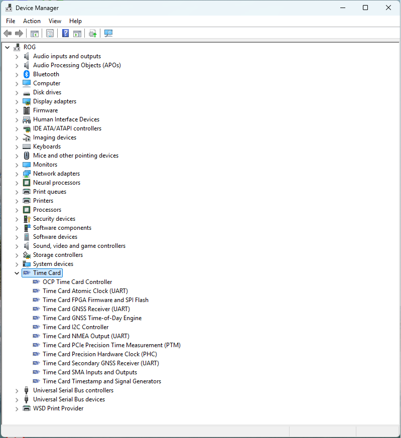

# Driver

Driver is based on a kernel module for CentOS and Ubunutu. 
Kernel 5.12+ is recommended

## Instruction
Make sure vt-d option is enabled in BIOS.   
Run the remake followed by modprobe ptp_ocp

## Modern kernels (6.x and later)

`ptp_ocp.c` carries version guards so it builds from 5.x up to current
kernels (verified against 7.0). The guarded APIs are: the PTM
cross-timestamp interface (`system_counterval_t.use_nsecs` with
`CSID_X86_ART` replaces `convert_art_ns_to_tsc()` on >= 6.10), timer APIs
(`timer_delete_sync`, `timer_container_of`), const-ified
`struct bin_attribute` callbacks and groups, the const
`device_find_child()` match signature, and the embedded PPS device.

### PTM (Precision Time Measurement)

With the LitePCIe-with-PTM gateware (release `TimeCardPTM_V31` or later)
the driver enables PCIe PTM at probe and implements `getcrosststamp()`
through hardware PTM dialogs, so `PTP_SYS_OFFSET_PRECISE` works and
`phc2sys`/`chrony` pick it up automatically — this removes the PCIe
read-asymmetry from PHC comparisons. The root port above the card must
advertise the PTM Root capability. Verify after boot:

```
lspci -vvv -s <card> | grep -A3 "Precision Time"   # Requester+ ... Enabled+
dmesg | grep "PTM enabled"
```

### Flashing note (spi-xilinx)

Updating the gateware via `devlink dev flash` needs the spi-xilinx fix in
`0002-spi-xilinx-Inhibit-transmitter-modern-kernels.patch` (a rebase of
the original 0001 patch, which no longer applies to current kernels).
Without it, erases succeed but page-program writes time out and the flash
chip locks up mid-update. Build the patched `spi-xilinx.ko` and install it
under `/lib/modules/$(uname -r)/updates/` before flashing.

## Outcome
```
$ ls -g /sys/class/timecard/ocp0/
total 0
-r--r--r--. 1 root 4096 Sep  8 18:20 available_clock_sources
-r--r--r--. 1 root 4096 Sep  8 18:20 available_sma_inputs
-r--r--r--. 1 root 4096 Sep  8 18:20 available_sma_outputs
-rw-r--r--. 1 root 4096 Sep  8 18:20 clock_source
lrwxrwxrwx. 1 root    0 Sep  8 18:20 device -> ../../../0000:02:00.0
-rw-r--r--. 1 root 4096 Sep  8 18:20 external_pps_cable_delay
-r--r--r--. 1 root 4096 Sep  8 18:20 gnss_sync
-rw-r--r--. 1 root 4096 Sep  8 18:20 internal_pps_cable_delay
-rw-r--r--. 1 root 4096 Sep  8 18:20 irig_b_mode
-rw-r--r--. 1 root 4096 Sep  8 18:20 pci_delay
drwxr-xr-x. 2 root    0 Sep  8 18:20 power
lrwxrwxrwx. 1 root    0 Sep  8 18:20 ptp -> ../../ptp/ptp4
-r--r--r--. 1 root 4096 Sep  8 18:20 serialnum
-rw-r--r--. 1 root 4096 Sep  8 18:20 sma1_in
-rw-r--r--. 1 root 4096 Sep  8 18:20 sma2_in
-rw-r--r--. 1 root 4096 Sep  8 21:04 sma3_out
-rw-r--r--. 1 root 4096 Sep  8 21:04 sma4_out
lrwxrwxrwx. 1 root    0 Sep  8 18:20 subsystem -> ../../../../../../class/timecard
lrwxrwxrwx. 1 root    0 Sep  8 18:20 ttyGNSS -> ../../tty/ttyS5
lrwxrwxrwx. 1 root    0 Sep  8 18:20 ttyMAC -> ../../tty/ttyS6
lrwxrwxrwx. 1 root    0 Sep  8 18:20 ttyNMEA -> ../../tty/ttyS7
-rw-r--r--. 1 root 4096 Sep  8 18:20 uevent
-rw-r--r--. 1 root 4096 Sep  8 18:20 utc_tai_offset
```

The main resource directory is accessed through the /sys/class/timecard/ocpN directory, which provides links to the various TimeCard resources.  The device links can easily be used in scripts:

```
  tty=$(basename $(readlink /sys/class/timecard/ocp0/ttyGNSS))
  ptp=$(basename $(readlink /sys/class/timecard/ocp0/ptp))

  echo "/dev/$tty"
  echo "/dev/$ptp"
```

After successfully loading the driver, one will see:
* PTP POSIX clock, linking to the physical hardware clock (PHC) on the Time Card (`/dev/ptp4`) 
* GNSS serial `/dev/ttyS5` 
* Atomic clock serial `/dev/ttyS6`
* NMEA Master serial `/dev/ttyS7`
* i2c (`/dev/i2c-*`) device

Now, one can use standard `linuxptp` tools such as `phc2sys` or `ts2phc` to copy, sync, tune, etc... See more in [software](/Software) section

## Windows Driver

The experimental Windows driver in `windows/` is a KMDF driver for the Meta
OCP TimeCard (`PCI\\VEN_1D9B&DEV_0400`). Windows does not provide a PHC class
equivalent to Linux `/dev/ptpN`, so applications use the driver's versioned
IOCTL ABI through `timecardctl.exe`.

### Features

* **PHC access**: read, set, and system-bracketed cross-timestamp IOCTLs.
* **Status**: FPGA/TOD version, synchronization, clock source, UTC/leap, and
  GNSS status registers.
* **Serial access**: polled access to the GNSS, GNSS2, MAC, and NMEA 16550
  UARTs. These are raw TimeCard IOCTL ports, not Windows COM ports.
* **Gateware layouts**: MSI and MSI-X/LitePCIe resource maps matching
  `ptp_ocp.c`.
* **Device hierarchy**: a KMDF bus model enumerates the PHC, GNSS/TOD engine,
  four UART functions, SMA/timing I/O, I2C, FPGA/SPI flash, and PCIe PTM as
  healthy raw child devices owned by the controller. INF null-driver matches
  assign each raw PDO to the Time Card class without loading another driver.
  Each raw PDO receives an explicit administrator/SYSTEM security descriptor,
  and hierarchy failure is fail-open so it cannot block the controller from
  starting.
* **Packaging**: a WDK desktop-driver project, INF validation, test signing,
  install helper, and verification helper.
* **Device Manager class and icon**: a dedicated **Time Card** category and a
  multi-resolution Time Card icon shared by the controller and child devices.

### Build and install

Use an x64 Visual Studio developer prompt with the Windows Driver Kit:

```bat
cd DRV\windows
build.cmd
powershell -ExecutionPolicy Bypass -File install.ps1
```

`install.ps1` must run as Administrator. It enables Windows test-signing and
stages the WDK test-signed package. Secure Boot must be off. Reboot, then run:

```powershell
powershell -ExecutionPolicy Bypass -File verify.ps1
```

The verification checks Device Manager state and exercises both the status and
PHC read paths against the installed card.

Subsystem enumeration is deliberately disabled on first install. On a machine
currently using the known-good `oem222.inf`, the guarded deployment helper
stages the new package, restarts only the Time Card PCI device, verifies PHC and
GNSS UART access, and automatically rolls back on failure:

```powershell
cd DRV\windows
powershell -ExecutionPolicy Bypass -File .\deploy-safe.ps1
```

No system reboot is performed. After the controller passes those checks,
enable the hierarchy live without making it a boot setting:

```powershell
timecardctl hierarchy-enable
```

Confirm every child device is healthy, then persist the setting:

```powershell
powershell -ExecutionPolicy Bypass -File verify.ps1 -ExpectHierarchy
timecardctl hierarchy-persist
```

`hierarchy-disable` clears persistence; existing child nodes disappear after
the parent device is restarted. Child creation is always fail-open, so a child
error cannot fail the controller's `AddDevice` path.

### Recovery from the legacy experimental class

The first experimental raw-PDO package used class GUID
`{49842651-EF23-47D4-BDF6-017A675C87AD}` and failed `AddDevice` with
`STATUS_INVALID_SECURITY_DESCR`. Keep the card disconnected and remove that
package from an Administrator shell:

```powershell
cd DRV\windows
.\rollback.ps1
```

`rollback.ps1` validates that legacy class GUID before removal because Windows
can reuse an `oemNNN.inf` published name for a later safe package. The fixed
hierarchy uses a fresh setup-class GUID, auto-names every secured raw PDO,
assigns every child an explicit SYSTEM/Administrators SDDL, and treats child
enumeration failure as non-fatal to the controller.

### Outcome

Device Manager's **Devices by type** view lists **OCP Time Card Controller**
and its subsystem devices in the dedicated **Time Card** category. **Devices
by connection** shows the subsystem PDOs nested under the PCI controller.
Windows does not support an arbitrary mixed-class folder in the default view;
future UART-to-COM or I2C class drivers would remain nested in the connection
view while appearing under their standard classes in the type view.



The subsystem nodes currently describe and group the hardware functions; PHC,
status, and raw UART operations continue through the controller IOCTL ABI. The
control tool supports:

```text
timecardctl status
timecardctl get
timecardctl set-system
timecardctl uart-config 0 115200
timecardctl uart-read 0 256 1000
```

Ports are `0=GNSS`, `1=GNSS2`, `2=MAC`, and `3=NMEA`. Kernel debugging and a
production EV/attestation-signed catalog are recommended before deploying the
Windows driver outside a development machine.

## Driver is included in the mainstream Linux Kernel
* Initial primitive version ([5.2](https://git.kernel.org/pub/scm/linux/kernel/git/netdev/net-next.git/commit/?id=a7e1abad13f3f0366ee625831fecda2b603cdc17))
* Exposing all devices version ([5.15](https://git.kernel.org/pub/scm/linux/kernel/git/torvalds/linux.git/commit/?id=773bda96492153e11d21eb63ac814669b51fc701)) 
