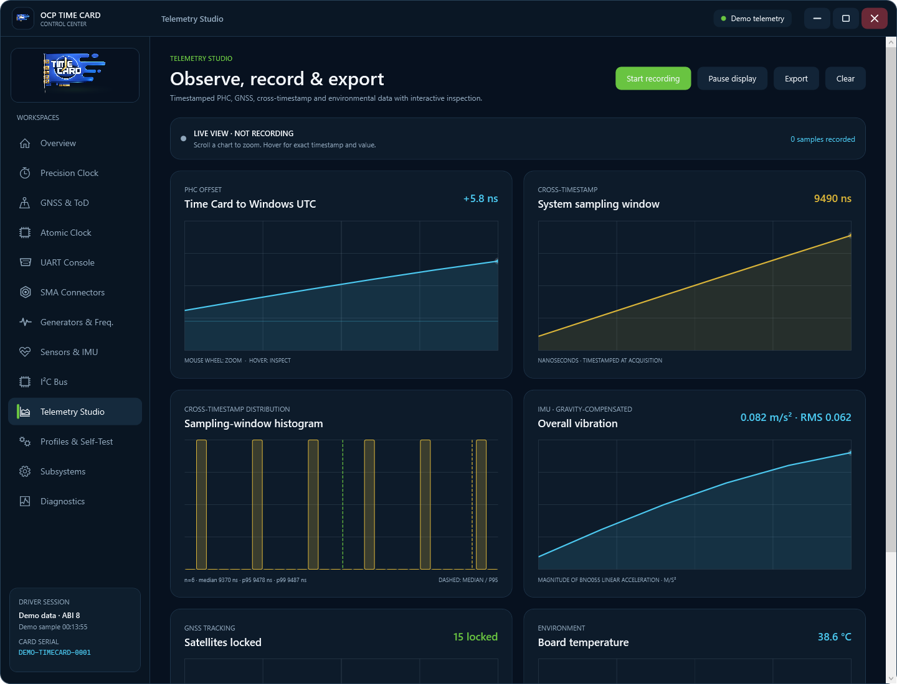
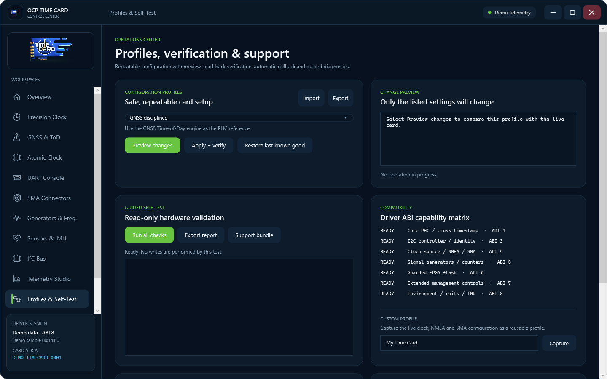
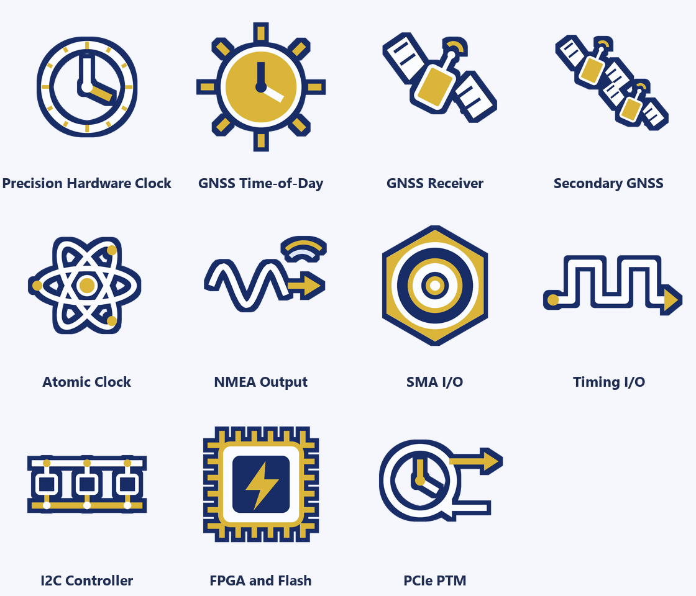
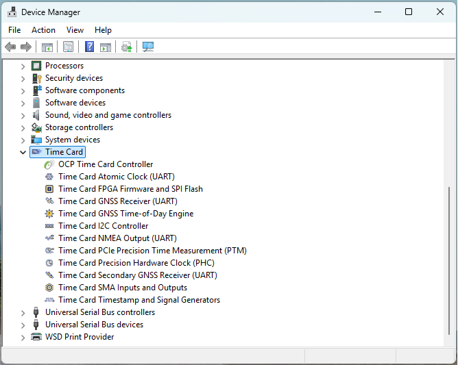

# Windows Time Card Driver

This directory contains the Windows x64 KMDF driver for every PCI Time Card
profile enumerated by the repository's Linux `ptp_ocp` driver:

- Meta/Facebook OCP Time Card: `PCI\VEN_1D9B&DEV_0400`
- Celestica OCP Time Card: `PCI\VEN_18D4&DEV_1008`
- Orolia/Safran ART Time Card: `PCI\VEN_1AD7&DEV_A000`

Windows does not provide a PHC class equivalent to Linux `/dev/ptpN`, so
applications use the versioned IOCTL ABI through `timecardctl.exe`.

## Features

- PHC read, set, and system-bracketed cross-timestamp operations.
- Direct Orolia/Safran ART mRO-50 FPGA-bridge telemetry and guarded fine,
  coarse, and nonvolatile coarse-adjustment controls.
- ABI 12 capability discovery and native ART oscillator discipline: consistent
  paired GNSS/mRO PPS timestamps, bounded PHC phase steps, exact Orolia miniCOD
  steering and calibration, and validated, page-aligned 24c08 parameter
  persistence with full read-back verification.
- ABI 13 read-only FPGA image identity on the standard MSI/MSI-X maps: raw
  word, loader encoding, decoded tag/version, layout, board profile, and exact
  trusted register offset. ART returns `STATUS_NOT_SUPPORTED` without an MMIO
  read because it does not publish that static image resource.
- ABI 15 exact-image synthesis contracts and a typed static core inventory.
  Optional registers are exposed only when the current raw image word,
  board profile, layout, explicit acknowledgement, and requested capability
  flags all match; the identity is revalidated before every optional access.
- FPGA, TOD, synchronization, selectable clock source, UTC/leap, satellite,
  and GNSS status reporting.
- Buffered access to the GNSS, GNSS2, atomic-clock, and NMEA 16550 UARTs. The
  driver uses the Linux MSI/MSI-X vector map when Windows exposes connectable
  interrupt resources and a burst-aware kernel poller otherwise, so complete
  high-rate u-blox frames survive the 16550 FIFO. FPGA NMEA enable, baud, and
  polarity are independently configurable.
- Validated query and routing control for all four SMA connectors, including
  input/output direction, named timing functions, fixed-direction detection,
  and immediate readback.
- Bounded configuration and readback for four periodic signal generators and
  four frequency counters, including repeat count, cable delay, sticky
  error/time-jump status, direct SMA input/output routing, and interrupt-backed
  completion/error/time-jump event queues.
- Six Signal Timestamper channels (GNSS1, TS1-TS4, and PHC/PPS) with bounded
  interrupt queues, overflow/drop accounting, polarity and enable control, and
  the documented counters/cable-delay/payload surface where the trusted
  register aperture supports it.
- Profile-gated control and readback for the documented PPS, IRIG-B/G, DCF77,
  and ToD input-parser FPGA cores, plus the adjustable clock's safe common
  telemetry and smooth clock adjustments. Exact-image contracts unlock the
  optional clock servo/log, holdover, outlier, limiter, aging, revert and
  dynamic-control registers; ToD telemetry and Master UTC handshake; IRIG AM,
  code and manual-year fields; and synthesized NTP, SyncE and dynamic clock
  sources. Other synthesis parameters select protocol and feature logic inside
  otherwise valid cores; register readback confirms the requested
  configuration, not that the selected logic was compiled into the image.
  IRIG/DCF cores follow aggregate SMA routing, so moving one connector cannot
  disable a core still used by another connector.
- Guarded Xilinx AXI IIC and OpenCores I2C controller access with status,
  address-only probes,
  7-bit bus discovery, bounded EEPROM/register reads, PCA9546A branch routing,
  dedicated IS32FL3207 LED updates, open/short diagnostics, and a bounded
  electrical test. The known identity devices are the board EEPROM at `0x50`
  and MAC EEPROM at `0x58`.
- Board-specific, guarded telemetry for the Meta BME280/BMP280 environment
  sensor, three INA219 power monitors, and BNO055/BNO08x IMUs, plus the
  Celestica R4006's three LM75B board-temperature monitors, SHT3x humidity
  sensor, ICP-10100 barometric sensor, and BNO08x IMU. Every transaction uses
  the schematic-defined PCA/TCA9546A route and restores the prior mux state.
- Guarded Xilinx and Altera SPI/SPI-NOR access for FPGA firmware query,
  4 KiB erase,
  page programming, and bounded read-back. All offsets are relative to the
  FPGA image region at `0x00400000`; the configuration region is unreachable.
- Non-destructive UART receive-activity observation for subsystem presence
  checks without removing bytes from the receiver FIFO.
- A stable six-byte card serial number read from the factory-programmed
  EUI-48 area at raw 24MAC402 offset `0x9a`, matching the identity Linux
  exposes through the `24mac402` NVMEM provider to `ptp_ocp`.
- MSI and MSI-X/LitePCIe BAR layouts matching the Linux `ptp_ocp` driver.
- A dedicated **Time Card** Device Manager class with custom controller and
  subsystem icons.
- Raw child devices for the PHC, TOD/GNSS engine, four UARTs, SMA and timing
  I/O, I2C, FPGA/SPI flash, and PCIe PTM.

The controller owns all hardware access. The child devices describe and group
the integrated functions; they do not load separate function drivers. Each
child is auto-named, explicitly secured for Administrators and SYSTEM, and
created through a fail-open path so an optional child cannot prevent the
controller from starting.

## Hardware compatibility

Driver 1.42 / ABI 15 selects the same three PCI profiles and resource maps as
the Linux `ptp_ocp` driver while keeping their board-level sensor populations
distinct. Meta/Facebook and Celestica share the rev1 and rev2 FPGA maps. Older
PCI revision 00 gateware uses the rev1 MSI map and may expose 2 or 32 interrupt
messages. Current PCI revision 02 LitePCIe gateware exposes 64 MSI-X messages
and uses the rev2 map. The Windows driver also checks that the selected PHC and
ToD windows fit the assigned BAR and falls back to the other known FPGA map
before any register access when firmware does not report a useful revision.

The Celestica R4006-G0001-03 Rev02 profile is identified by
`PCI\VEN_18D4&DEV_1008`. Its TCA9546A at `0x70` uses fixed, isolated routes:
channel 0 for three LM75B monitors at `0x48`/`0x49`/`0x4a`, channel 1 for the
SHT3x at `0x44`, channel 2 for the ICP-10100 at `0x63`, and channel 3 for the
BNO08x at `0x4a`. Driver 1.39 validates Sensirion/TDK CRC-8 frames, retrieves
and caches the pressure sensor's four OTP coefficients, and exposes raw values
plus compensated environmental telemetry without confusing identical I2C
addresses that live on different mux branches.

The Orolia/Safran ART profile uses its Linux-defined fixed map: PHC at
`0x01000000`, primary GNSS UART at `0x00161000`, mRO-50 UART at `0x00190000`,
board configuration at `0x00210000`, Altera SPI at `0x00310000`, the direct
mRO-50 bridge at `0x00340000`, OpenCores I2C at `0x00350000`, and fixed SMA
routing at `0x003c0000`. The PCI parser accepts both the leading `PCI\VEN_`
field and ampersand-delimited fields, so `VEN_1AD7&DEV_A000` can no longer
silently fall back to the Meta register map.

The tested ART FPGA v0.0.9 exposes the PHC, direct mRO-50 bridge, primary GNSS
UART, fixed SMA map, OpenCores I2C/24c08 EEPROM, timestamp inputs, and Altera
SPI-NOR. It does not implement the Meta-specific ToD/NMEA engine, secondary
GNSS, signal generators, frequency counters, PTM, PCA9546A sensor branches, or
IS32FL3207 LEDs. Those capabilities are reported as not implemented or not
fitted instead of producing failed sensor and LED operations.

The mRO-50 bridge reports enable/lock, raw temperature, and fine/coarse
adjustment words without depending on the optional 16550 serial bridge. The
temperature is intentionally displayed as a raw word because its physical
scale is not published for this gateware image. The mRO serial port is still
configured for 9,600 baud when present.

Linux assigns no fixed baud to the ART primary-GNSS UART. Driver 1.35 likewise
preserves its gateware divisor during device start; an operator may still set
an explicit baud from the UART workspace or `timecardctl uart-config`.

ART's 24c08 responds through bank addresses `0x50` through `0x57`. On the
tested card it contains two copies of the mRO disciplining configuration,
beginning with `oscillator=mRO50`, rather than the legacy serial layout at
absolute offset `0x263`. Driver 1.35 detects that layout and returns an invalid
identity instead of turning configuration text into a false serial number.
Its four fixed SMA routes remain read-only in the Control Center.

Subsystem availability still depends on the FPGA image and populated board
options. Missing optional resources never prevent the controller and PHC from
starting.

## Documented FPGA timing cores

ABI 15 covers every software-accessible core surface identified by the timing
manual and UCM audits. Capabilities come from the trusted static board maps;
`IOCTL_TIMECARD_CORE_INVENTORY_QUERY` reports typed offsets, spans, instances,
versions and interrupt messages without using Configuration Slave discovery or
probing guessed addresses. Each requested core then validates its common
version register before any revision-dependent field is read.

The general Signal Timestamper path exposes all six published channels with a
bounded kernel event queue and D0-safe interrupt lifecycle. Standard MSI/MSI-X
images expose the documented v1.3 counters, cable delay and payload aperture.
ART exposes only its published basic enable, polarity, interrupt and timestamp
surface; extended ART offsets stay inaccessible until an ART image identity and
build manifest make them trustworthy. Signal generators similarly publish
bounded completion/error/time-jump events on vectors 11-14 (MSI) or 43-46
(MSI-X).

Common Adjustable Clock registers provide smooth offset/drift updates,
intervals, Q16 fractional drift from 2.0, and the in-sync threshold. Optional
clock registers require a matching exact-image contract: servo/log from 1.6,
holdover from 2.1, outlier filters from 2.2, rate limiters from 2.3, dynamic
updates from 2.4, aging from 2.5, and revert from 2.6. NTP source selector 7
requires Clock 1.8 plus a synthesized-NTP contract. SyncE selector 8 and dynamic
selector 253 require Clock 2.7 plus their respective contracts.
The advanced query also returns the base status word and decodes the documented
holdover-ready and aging-ready state separately from the feature-presence bits.

ToD Slave supports NMEA, UBX, TSIP, ESIP, and PFEC selector 4 with PFEC mask
`0x7f`. UTC/leap/GNSS/satellite telemetry is protocol- and revision-gated and
also requires the image contract. ToD Master `GxUTC` uses the bounded read
request/done handshake and a bit-0-only write request. IRIG Master 1.5 AM,
IRIG Slave 1.5 code/manual year, and IRIG Slave 1.6 AM are likewise contract-
gated. PPS, timecode, ToD, NMEA, generator, smooth-clock, and advanced-clock
sets snapshot the affected registers, verify exact readback, and restore the
complete prior configuration on failure, including the corresponding UART
baud where applicable.

`IOCTL_TIMECARD_GET_FPGA_CAPABILITIES` reports the profile-advertised core
mask, feature mask, and unresolved hardware limitations. The Control Center's
**FPGA Engines** workspace presents only the fields confirmed by the kernel;
it never interprets a core version as proof of a synthesis generic. The
Orolia/Safran ART profile does not advertise absent Meta/Celestica cores.

`IOCTL_TIMECARD_FPGA_IMAGE_QUERY` reads one 32-bit identity word from the
Linux-defined static image resource at `0x00020000` (MSI) or `0x02020000`
(MSI-X). Zero and `0xffffffff` are rejected. The result preserves the raw word
and decodes the same loader form, image tag, and 15-bit major/minor version as
Linux `ptp_ocp`. It is identity metadata, not a synthesis-feature manifest;
optional core behavior still requires hardware or loopback validation. The
Control Center includes it in FPGA diagnostics and captured profile
compatibility metadata, and `timecardctl fpga-status` prints it.

The complete manual-by-manual and UCM audit, including the features that require
future bitstream work rather than host software, is in
[FPGA_CORE_COVERAGE.md](FPGA_CORE_COVERAGE.md).

## Native oscillator discipline

Driver 1.42 / ABI 15 exposes a capability-first ABI instead of asking user mode to infer
hardware from a PCI ID or probe arbitrary MMIO. `IOCTL_TIMECARD_GET_CAPABILITIES`
reports the board profile, oscillator type, safe steering ranges, paired-PPS
indices, phase-step support, temperature telemetry, hardware-discipline support,
and whether a writable discipline EEPROM is present.

On Orolia/Safran ART, the driver maps the FPGA's GNSS PPS timestamp input 0 and
internal-oscillator PPS timestamp input 5. A phase sample latches both timestamp
counters consistently and reports `oscillator - reference`, normalized to one
PPS period. Capture uses polling mode with its interrupt masks disabled, is
suspended safely across D0 exit, and is restored only when an application had
requested it. PHC corrections are relative and bounded to
`-499999999..499999999` ns. Direct mRO-50 fine and coarse writes are constrained
to the published miniCOD ranges (`0..4800` and `0..0x3fffff`).

The native `TimeCardDiscipline.dll` is a small stable Windows C ABI around the
vendored Orolia `disciplining-minipod` 3.6.0 implementation used by
`oscillatord` 3.10.0. The native runtime feeds it the paired phase, GNSS-valid,
lock, temperature, fine/coarse, survey state, and the previous u-blox TIM-TP
quantization error, then applies only the returned bounded action. GNSS fix,
leap, survey, and RF state come from a checksum-valid continuous UBX session
that associates NAV-PVT, NAV-TIMELS, TIM-TP (normalized from its documented
next-pulse iTOW), and TIM-SVIN and decodes MON-RF antenna power/status. It uses
only fresh, unconsumed UART epochs paired with newly advanced, error-free FPGA
GNSS/oscillator PPS counters. Full calibration uses miniCOD's three-point plan
and 50 valid paired PPS samples per point. Parameters are loaded from and saved
to the ART 24c08 layout (configuration at `0x000`, temperature table at `0x090`)
and a host backup under `%ProgramData%\OCP Time Card`; writes require version-1
headers and are verified byte for byte.

The Control Center and native `OcpTimeCardOscillatord` Release builds carry
this native library as a verified embedded resource, so neither loads a loose
miniCOD DLL. The service replaces the Linux/WSL daemon for continuous Windows
discipline. WSL is needed only when intentionally building, running, or
testing the separate Linux driver and Linux tools.

u-blox receiver reconfiguration is deliberately separate from ordinary UART
monitoring. It defaults off and requires the explicit
`gnssReceiverReconfigure` service setting. When enabled, the service detects the
live receiver baud, sends one bounded CFG-VALSET profile, and requires the
receiver's ACK before continuing. Persistence is another opt-in:
`gnssPersistConfiguration=false` changes RAM only, while true also selects
battery-backed RAM and flash. The profile covers one-hertz navigation,
NAV-PVT/NAV-TIMELS/TIM-TP/TIM-SVIN/MON-RF, TP1 time grid and cable delay, and
optional RTCM/raw-observation output.

`TimeCardOscillatord.exe` hosts that engine as a delayed-start native Windows
Service. It uses the ABI 14 exclusive discipline lease and initializes the PHC
only from a fresh, iTOW-coherent GPS-grid NAV-PVT/NAV-TIMELS/TIM-TP epoch. Each
set is armed against exactly the next valid FPGA reference edge; missed or
extra edges, unsafe phase magnitude, stale/reused epochs, a leap boundary,
startup timeout, or failed post-write GNSS/PHC verification aborts alignment.
The service survives card removal and reinsertion, keeps calibration state
separate by card identity, and publishes telemetry over a protected local named
pipe plus an optional compatible TCP endpoint. Read-EEPROM responses include
presence/validity, length, SHA-256, and the exact binary image as JSON
`data_base64` for read-only diagnostics.

The Control Center uses the protected local service pipe by default and hides
all network settings. Its optional **Remote oscillatord** mode reveals the host,
TCP port, and non-persistent token and uses explicit TCP for a remote Windows or
Linux service. TCP is unencrypted and should remain on a trusted network or in
a protected tunnel.

On a multi-card host, `oscillatord.json` can select the target by the preferred
six-byte `deviceSerial`, by an exact enumerated `devicePath`, or by both for a
fail-closed cross-check. `deviceIndex` remains a compatibility fallback only;
its sorted position can change when the installed-card inventory changes.
Per-card host calibration uses the serial when valid and otherwise a hash of the
stable device-interface path, never a shared board-profile directory.

With `gnssRtcmEnabled=true`, a separate protected local-only binary pipe,
`\\.\pipe\OcpTimeCard.Rtcm.v1`, forwards only complete CRC-24Q-valid RTCM3 and
checksum-valid UBX-RXM-RAWX/SFRBX frames. Its drop-oldest queue is bounded to
256 frames and 1 MiB, so an absent or slow local reader cannot block the GNSS
discipline path; remote pipe clients are rejected. With receiver reconfiguration
also enabled, the service requests the matching u-blox output set. Otherwise it
forwards matching frames only when the receiver is already configured to emit
them.

`TimeCardTimeProvider.dll` can be registered explicitly as a W32Time hardware
input provider; it replaces the Linux NTP-SHM/chrony path without repeatedly
stepping the Windows clock from the service. The service publishes only a
synchronized PHC with a bounded cross-timestamp window and an eligible locked
or holdover-ready discipline state. The provider independently rejects stale,
malformed, changing, unsynchronized, excessive-offset, delay, or dispersion
samples before offering one to W32Time. Freshness is measured from the
monotonic instant of the driver cross-timestamp capture rather than its later
publication. A W32Time `TPC_TimeJumped` notification rejects all prior and
in-flight associations until a new capture arrives beyond a one-second
monotonic settling barrier. See
[TimeCardOscillatord/README.md](TimeCardOscillatord/README.md) for build,
installation, configuration, and safety details.

Meta/Facebook boards with a MAC-SA53 use the existing atomic-clock hardware
discipline workspace. Celestica and future Linux-listed variants are detected
through the same capability query; a protocol must identify successfully before
configuration is offered, otherwise the UI remains monitor-only. ART-only phase,
mRO, and EEPROM operations return `STATUS_NOT_SUPPORTED` on every other profile.

The command-line surface is also available for automation:

```powershell
.\out\timecardctl.exe capabilities
.\out\timecardctl.exe phase-status
.\out\timecardctl.exe phase-enable
.\out\timecardctl.exe phase-disable
.\out\timecardctl.exe discipline-read art-discipline.bin
```

`phc-adjust` and `discipline-write` are deliberately explicit administrator
commands. The latter accepts exactly 512 bytes with valid configuration and
temperature-table headers; the kernel driver performs the final validation and
read-back.

The rev1 path has been validated on a connected revision 00 implementation
with a 32 MiB BAR, 16 assigned MSI messages, clock core 1.2.0, and ToD core
2.0.0.1. Its PHC, primary GNSS/NMEA stream, NMEA generator, four SMA routes,
I2C controller, board EEPROM, and MAC EEPROM are accessible. That FPGA image
returns all ones for the optional GNSS summary registers; raw UART access
continues to work and the Control Center reports those summaries as unavailable
instead of interpreting them as 255 satellites.

## Build

Install Visual Studio with the Windows Driver Kit, then use an x64 developer
prompt:

```bat
cd DRV\Windows
build.cmd
```

Build output is written to:

- `x64\Release\timecard\` - driver package (`timecard.inf`, `timecard.sys`,
  `timecard.cat`, the controller icon, and subsystem icons).
- `out\timecardctl.exe` - command-line control tool.

Run the hardware-independent FPGA and product checks from this directory:

```powershell
.\tools\test-fpga-abi.ps1
.\tools\test-fpga-advanced.ps1
.\tools\test-board-profiles.ps1
.\tools\test-multi-card-control-center.ps1
```

`test-fpga-advanced.ps1` verifies ABI 15 layouts, revision and synthesis gates,
interrupt maps, trusted static inventory, transactional rollback, and 1.42
metadata without opening the device. It does not replace real signal loopback
or interrupt-load testing.

## Time Card Control Center

The repository also includes a polished native Windows dashboard covering live
PHC telemetry and clock synchronization, u-blox GNSS configuration and a sky
map, Microchip MAC-SA53 atomic-clock control, protocol-aware u-blox UART
decoding, decoded FPGA NMEA sentences, dynamically enumerated Windows COM
ports, and multi-format raw monitoring,
NMEA generation, SMA routing, timing generators and frequency counters,
sensors and IMU telemetry, I2C mux and status-LED control, subsystem hierarchy,
FPGA firmware updates, and engineering diagnostics. The application includes
an animated, aspect-preserving Time Card identity, a polished splash screen,
clear connection state, and one-click administrator restart when required.
It also includes a clickable end-to-end timing health topology with a dedicated
right-side lane for the four SMA endpoints, a timestamped
Telemetry Studio with CSV/JSON recording, cross-timestamp distribution and
percentiles, and a gravity-compensated IMU vibration trace with rolling RMS;
verified configuration profiles with automatic rollback; a read-only guided
hardware self-test; privacy-conscious ZIP support bundles; responsive themes;
and a synthetic no-write demo mode.
The serial laboratory supports complete generic COM framing and flow-control
settings, filters, counters, capture, offline decoder replay, and text, CSV,
JSON, or binary export.

```powershell
.\build-gui.cmd release
.\TimeCardControlCenter\bin\Release\TimeCardControlCenter.exe
.\package-control-center.ps1 -SkipBuild
```

The application can restart itself with administrator rights when the driver
requires elevation. See [TimeCardControlCenter/README.md](TimeCardControlCenter/README.md)
for complete build, UART, and capability details.

Driver **1.42 / ABI 15** is required for the complete feature set shown below.


| Precision clock | GNSS and sky map | Atomic clock |
| --- | --- | --- |
|  |  |  |
| UART and NMEA | SMA connectors | Generators and frequency |
|  |  |  |
| Sensors and IMU | I2C and status LEDs | Subsystem map |
|  |  |  |
| Telemetry Studio | Profiles and self-test | FPGA SPI flash |
|  |  |  |

The default Release build is unsigned and ready for Microsoft production
signing. Use `build.cmd test` only for a local development package. To create
the HLK driver folder and an attestation CAB, see
[PRODUCTION_SIGNING.md](PRODUCTION_SIGNING.md).

## Install

For local development only, build a test-signed package first:

```bat
build.cmd test
```

Secure Boot must be disabled before that locally test-signed kernel driver can
load. From an Administrator PowerShell prompt:

```powershell
cd DRV\Windows
.\install.ps1
```

The script enables Windows test-signing and stages or installs the package.
Reboot when requested, then verify the controller:

```powershell
.\verify.ps1 -SetFromSystem -TestGnssUart
```

## Device hierarchy

Subsystem enumeration is enabled by default for every newly installed
supported card. The controller therefore appears with its PHC, ToD/GNSS,
UART, SMA, timing, I2C, flash, and PTM children immediately. Verify it with:

```powershell
.\verify.ps1 -ExpectHierarchy -TestGnssUart
```

For recovery or comparison testing, an administrator can still disable the
hierarchy persistently and later re-enable it:

```powershell
.\out\timecardctl.exe hierarchy-disable
.\out\timecardctl.exe hierarchy-enable
.\out\timecardctl.exe hierarchy-persist
```

An explicit persisted disable takes precedence over the default. Existing
child nodes disappear after the Time Card device or Windows is restarted.

## Control tool

Run the tool from an Administrator prompt:

```text
timecardctl status
timecardctl get
timecardctl fpga-status
timecardctl fpga-inventory
timecardctl fpga-contract-status
timecardctl fpga-contract-set 0x12345678 clock-advanced,tod-telemetry acknowledge
timecardctl clock-telemetry
timecardctl clock-adjust-status
timecardctl clock-adjust-set offset 100 1000000 threshold 250
timecardctl clock-advanced-status
timecardctl pps-status
timecardctl pps-set master on active-high 0 500
timecardctl timecode-status
timecardctl timecode-set irig master on -37 0 1 7
timecardctl timecode-set irig master on -37 0 1 7 0x12345 --am on
timecardctl timecode-set irig slave on 37 250 1 2 --year 2026
timecardctl tod-status
timecardctl tod-set on pfec 1 115200 normal 0 0x00
timecardctl signal-status
timecardctl signal-clear 1
timecardctl signal-events 1 16
timecardctl timestamp-status
timecardctl timestamp-set ts1 on rising 25 clear-error clear-queue
timecardctl timestamp-read ts1 16
timecardctl set-system
timecardctl clock-source synce
timecardctl serial
timecardctl nmea-status
timecardctl nmea-set on 9600 normal
timecardctl nmea-utc-status
timecardctl nmea-utc-set 37 valid none
timecardctl uart-read 3 256 1000
timecardctl uart-config 0 115200
timecardctl uart-read 0 256 1000
timecardctl uart-observe 0 25
timecardctl mro-status
timecardctl mro-fine 2344
timecardctl mro-coarse 4186399
timecardctl mro-save-coarse
timecardctl flash-status
timecardctl hierarchy-status
timecardctl hierarchy-enable
timecardctl hierarchy-persist
timecardctl hierarchy-disable
timecardctl sma-status
timecardctl sma-status 1
timecardctl sma-set 1 input 0x0001
timecardctl sma-set 3 output 0x0001
timecardctl sma-set 1 disabled
timecardctl i2c-status
timecardctl i2c-scan
timecardctl i2c-read 0x50 0x00 32 1
timecardctl sensors
timecardctl led-status
timecardctl led-set 1 0 180 30 96
timecardctl led-test
```

UART ports are `0=GNSS`, `1=GNSS2`, `2=atomic clock`, and `3=NMEA`.

Do not copy the example `0x12345678` contract word. Read the installed card's
raw word with `fpga-contract-status`, verify the exact bitstream build manifest,
then activate only the capabilities that manifest guarantees. The contract is
session-scoped, must match the board and layout, and is invalidated by an image
change. `clock-servo-log`, `clock-advanced`, `tod-telemetry`, `tod-utc-read`,
`tod-utc-write`, `irig-master-am`, `irig-slave-am`, `irig-slave-year`,
`ntp-source`, `synce-source`, and `dynamic-source` are independently selectable;
UTC write also requires UTC read. ART extended timestamp support remains
unavailable until ART has a trusted image identity and aperture manifest.

SMA selectors use the same values as Linux `ptp_ocp`. Common input values are
`0x0000=10 MHz`, `0x0001=PPS1`, `0x0002=PPS2`, `0x0004=TS1`,
`0x0010=IRIG-B`, and `0x0020=DCF77`. Common output values are `0x0000=10 MHz`,
`0x0001=PHC`, `0x0002=atomic clock`, `0x0004=GNSS1`, `0x0008=GNSS2`,
`0x0010=IRIG-B`, and `0x0020=DCF77`. Fixed-direction firmware is handled with
the same mode-change ordering as Linux: the driver never writes the absent
opposite-direction map and verifies the applied function by immediate
readback. Disconnect an external source before changing a connector to output.

I2C reads use 7-bit addresses. `i2c-read` performs a combined subaddress write
and repeated-start read; the final argument selects a 0-, 1-, or 2-byte
subaddress. Transfers are limited to 255 bytes. The `serial` command reads the
same six identity bytes used by the Linux `serialnum` attribute. The ABI
deliberately provides no I2C data-write or EEPROM-programming operation.
On ART configuration-layout EEPROMs, `serial` deliberately reports invalid
identity data. Use `mro-status` for non-destructive oscillator telemetry.
`mro-fine` and `mro-coarse` steer the oscillator immediately;
`mro-save-coarse` persists the current coarse setting and should be used only
after the desired value has been verified.

Driver 1.11 fixes the AXI IIC dynamic-receive completion sequence. It waits for
the optional subaddress message to leave the transmit FIFO, drains data only
after the receive watermark event, advances that watermark for reads longer
than one FIFO, and clears the expected final receive NACK with `RX_FULL`. A
failed transient transaction is reset and retried once within the requested
bounded timeout. Driver 1.12 also reports controller transport failures as I/O
device errors instead of the misleading Windows "CRC data error" translation.

The NMEA generator is separate from the UART receiver. The driver deliberately
does not probe or initialize the optional ToD Master during D0 entry: a register
address fitting inside BAR0 does not prove that an older FPGA image decodes that
AXI slave, and an automatic boot-time access could prevent the card from
starting. `nmea-status` and `nmea-set` remain explicit operator-initiated IOCTL
paths; they validate the core version before accessing revision-dependent
fields. `nmea-set` also keeps the UART 3 receiver divisor synchronized with the
generator baud. Supported rates are 1,200 through 2,000,000 baud using the
selector table from Linux `ptp_ocp`. The FPGA's existing generator state is
left untouched during device start.

Driver 1.40 / ABI 13 extends the same fixed-size `TIMECARD_NMEA_CONTROL`
record with the documented ToD Master correction, local-zone offset, GNSS
talker and message gates. `nmea-set` accepts the extended form
`<on|off> <baud> <polarity> <correction-s> <local-minutes> <gnss> <mask>`.
The mask uses bit 0 for RMC (core 1.4+), bit 1 for ZDA, and bit 2 for the
optional proprietary UTC sentence (core 1.6+). Writes preserve unknown bits,
disable the core while changing configuration and verify every setting by
readback. The synthesis-optional UTC-info registers remain inaccessible by
default; ABI 15 can use them only after an exact-image UTC read/write contract
has been activated for the current card session.

ToD Master 1.1 and newer also expose a sticky transmitter-error status bit.
`nmea-status` reports it as `transmitter ERROR`; ordinary queries and settings
never acknowledge it. After correcting the configuration, append `clear` to
either `nmea-set` form to issue the documented write-one-to-clear operation,
for example `timecardctl nmea-set on 9600 normal clear`. The clear request is
revision-gated and preserves the enable, baud, polarity, correction, local
offset, GNSS talker, sentence gates, and unknown control bits.

Driver 1.10 / ABI 5 adds dedicated controls for all four periodic signal
generators and frequency counters. Generator configuration follows the Linux
`ptp_ocp` register sequence: disable, program a PHC-aligned start, period,
pulse width and polarity, then assert valid plus enable. Frequency counters
accept an integration window of 0 (disabled) or 1–255 seconds and report the
FPGA valid, error, overrun, and 24-bit frequency-result fields.

The existing 64-byte generator request also supports an opt-in absolute start
without an ABI or structure-size change. `signal-set` retains phase-aligned
scheduling. `signal-set-at` instead supplies the exact 32-bit PHC/TAI seconds
and 0-999,999,999 nanosecond registers. The request is rejected unless the
target is more than 1 ms ahead of a fresh PHC sample; all validation and time
calculation precede MMIO mutation, exact start readback is required, and a
failed transaction restores every prior generator register. The absolute flag
is request-only and is never returned by `signal-status`.

The signal-generator manual section 3.2.1.3 defines polarity bit 0 as `1`
active-high and `0` active-low. The public flag and UI now use those names
without changing the raw bit. `timecardctl` continues accepting the legacy
`inverted`/`normal` spellings as source and script compatibility aliases.

PHC acquisition and all start-time overflow checks complete before the driver
disables a generator. If final register readback fails, the driver restores the
previous polarity, cable delay, repeat count, start, period, pulse, enable, and
interrupt-mask words so a failed request cannot alter an output that was
already configured or running.

Signal-generator Error and TimeJump status bits are sticky. `signal-status`
reports them without acknowledging them; `signal-clear <generator>` issues the
documented write-one-to-clear mask through a clear-only ABI 13 request. That
path does not disable, reschedule, or otherwise reconfigure a running output.

Driver 1.12 / ABI 6 adds the guarded FPGA flash interface and UART activity
observation. The SPI controller offsets, Xilinx FIFO sequence, FPGA image
start, 4 KiB erase geometry, and OCPC image-header format follow Linux
`ptp_ocp`. Flash programming cannot address bytes below `0x00400000`, cannot
cross a 256-byte page, and requires write-enable plus ready polling. The
Control Center performs a complete read-back comparison after programming.

Driver 1.13 / ABI 7 adds schematic-aware controls for U27, the PCA9546A at
`0x70`, and U6, the IS32FL3207 on mux channel 1. The four mux bits
route the MAC clock, sensor, analog/ADC expansion, and DC expansion branches.
LED IOCTLs are limited to the six RGB indicators (GNSS1, GNSS2, IO1–IO4),
use 8-bit PWM, cap global current at 128, and restore the caller's mux mask
after every operation. Arbitrary I2C writes and EEPROM programming remain
unavailable.

Driver 1.14 / ABI 7 corrects the AXI IIC dynamic-mode startup handshake,
preventing the stale bus-not-busy latch from ending a transaction before its
START reaches the bus. It also reads the factory
EUI-48 from raw 24MAC402 offset `0x9a` and uses U6's 7-bit address `0x37`;
the schematic's `0x6e` label is the corresponding 8-bit write address.
Driver 1.14.6 also reports the IS32FL3207 per-output open/short masks and
supports a bounded electrical test. The test proves SDB state through the
device reset behavior, forces OUT1-18 on in DC mode for five seconds, and then
restores the prior colors. It does not expose arbitrary I2C writes.

Driver 1.15.1 / ABI 8 adds a guarded sensor-telemetry query for every populated
device on PCA9546A channel 1. It triggers a compensated BME280 environment
sample at `0x76`, reads the +12 V, +5 V, and +3.3 V INA219 monitors at `0x40`,
`0x41`, and `0x44` using the schematic's 2 milliohm shunts, and starts the
BNO055 at `0x29` in NDOF fusion mode with the fitted 32.768 kHz crystal. A
failed or absent sensor is reported independently. The driver restores the
caller's mux mask after every sample and still exposes no arbitrary write API.

Driver 1.18 / ABI 8 corrects the short-transfer completion ordering to match
Linux `i2c-xiic`: START/address is queued, stale completion state is cleared,
and only then is the register payload appended. This prevents a fast
one-register transaction from losing its real TX-empty event. The driver
auto-detects BME280 or BMP280 at `0x76`/`0x77`, BNO055 at `0x28`/`0x29`, and
all four IS32FL3207 AD strap addresses (`0x34`-`0x37`), while continuing to
prefer the V9 schematic's `0x76`, `0x29`, and `0x37` choices. LED programming
now reads back control, global current, per-channel scaling, PWM, and DC-mode
registers before reporting success.

Driver 1.19 / ABI 8 initializes any responding INA219 that firmware left in
reset/power-down. It programs the safe 32 V, +/-320 mV, 12-bit continuous
bus-and-shunt configuration, verifies the configuration readback, waits for a
conversion, and then reports voltage/current/power from the board's 2 milliohm
shunt.

Driver 1.23 / ABI 8 adds the verified Rev00/MSI indicator wiring map without
changing the original Rev02/MSI-X card: GNSS1/GNSS2 exchange physical groups
with IO3/IO4, IO1/IO2 remain direct, and red/green sink channels are exchanged.
Logical names and RGB values therefore remain consistent in the Control
Center on both assemblies. It also auto-discovers the populated sensor branch
instead of assuming PCA9546A channel 1 and supports the schematic-permitted
BNO080/BNO08x alternative at `0x4a`/`0x4b`. BNO08x SHTP reports are configured
and decoded into the existing ABI's fused orientation, acceleration, linear
acceleration, gravity, angular-velocity, and magnetic-field readings; BNO055
cards continue to use the NDOF register path.

Driver 1.24 adds a BNO08x liveness watchdog. If the IMU resets internally or
its finite SH-2 report queue stalls while the mux branch is idle, the next
telemetry request drains stale packets, re-establishes all six motion-feature
subscriptions, resets the SHTP control-channel sequence, and retries the
sample without requiring a driver reload or reboot.

Driver 1.25 also requests and decodes the optional SH-2 ambient-temperature
report `0x0e` as signed Q7 degrees Celsius. The temperature-valid flag is set
only when the installed BNO08x firmware actually publishes that report, so
motion telemetry remains unchanged and the Control Center continues to show
temperature as unavailable on firmware without an environmental source.

Driver 1.35 keeps the Rev00 BNO08x on its discovered mux route while resolving
the BME/BMP280 and INA219 routes independently. It tries the V9 schematic's
PCA9546A channel 1 (`mask 0x02`) first, then the remaining known assembly
routes without disturbing the IMU selection. This prevents any alternate IMU,
environment, or power-monitor route from hiding another populated device.
Each address that returns no I2C ACK is reported independently as not fitted or
unpowered instead of being shown as zero telemetry.

Driver 1.35 also handles V9 register reads that ACK the pointer write but return
a read-address NACK during the AXI-IIC dynamic repeated START. After that
specific NACK, BME280,
BMP280, and INA219 reads are retried as a STOP-terminated register-pointer write
followed by a bounded read. These devices retain their register pointer across
STOP; the fallback leaves the existing repeated-START path in place for every
device that accepts it. The Control Center renders the IMU quaternion as a
compact, smoothed, color-keyed 3D cube alongside the numeric heading, roll, and
pitch. Each face carries one of the six color Time Card marks, centered and
aspect-preserved. It holds the last good pose across isolated invalid or
identity `0°, 0°, 0°` samples; a real zero orientation is accepted after three
consecutive valid samples. Cards without an IMU use an automatic three-axis
showcase rotation so all six faces are presented.
The Sensors workspace samples automatically and replaces its former manual
refresh control with a rolling 60-second acquisition-latency graph, including
the current and minimum/maximum sensor-read time.

Driver 1.37 / ABI 10 adds the schematic-exact Celestica R4006 sensor profile.
It reads all three LM75B board-temperature monitors on TCA9546A channel 0,
factory-compensated SHT3x temperature/humidity on channel 1, CRC-checked
ICP-10100 raw pressure/temperature and OTP calibration on channel 2, and the
BNO08x SH-2 stream on channel 3. The command-line tool and Control Center label
this population directly instead of looking for Meta-only BME280 and INA219
parts. The IMU visualization is also smaller and rejects isolated identity
samples before allowing a genuine sustained zero orientation.
The same profile maps the IS32FL3207 at `0x34` to the schematic's single GPS
indicator and four SMA indicators, swaps its green/red output order, masks the
unconnected OUT16-18 fault bits, and reports the second GNSS indicator as not
fitted rather than driving an unconnected output group.

Driver 1.39 / ABI 12 audits all twelve FPGA manuals in `SOM/FPGA/Doc` and
adds capability-first PPS, IRIG-B/G, DCF77, ToD-parser, clock-telemetry, and
extended signal-generator controls. Register layouts are selected from the
trusted Linux board profiles; each explicitly requested core is checked at its
common version register before revision-specific fields are accessed. Writes
use documented bounds, reserved-bit preservation, disable/configure/restore
sequencing, explicit W1C actions, and value-by-value readback verification.
The same audit corrects logical ToD polarity, signed delays/corrections, IRIG
mode handling, SMA route ownership, and generator interrupt/status handling.
It deliberately does not probe the uninstantiated Configuration Slave or
synthesis-optional clock/ToD registers that lack a published capability bit.
It also does not infer synthesis-enabled behavior from a core version: the
current bitstreams publish no capability word for dynamic PPS features,
signal-generator cable delay, IRIG-B/G variants, or ToD protocol/message
parsers. Register readback must be followed by hardware signal, loopback, or
known-stream validation for those functions.

Driver 1.40 / ABI 13 additionally exposes the Linux-compatible FPGA image
identity through a fixed-size, read-only IOCTL. It reads only the two trusted
static MSI/MSI-X image offsets, rejects invalid bus-fill values, and never
attempts this access on ART. The identity makes diagnostics and exported
profiles traceable to a board layout and bitstream version without pretending
to know synthesis generics that the image does not publish.

Driver 1.42 / ABI 15 completes the software-feasible FPGA/UCM audit gaps. It
adds six-channel interrupt-backed Signal Timestamper capture, generator
completion events, smooth and advanced Adjustable Clock control, PFEC and
protocol-specific ToD telemetry, ToD Master UTC handshakes, IRIG AM/code/year,
and the read-only static core inventory. Optional accesses require the
session-scoped exact-image contract and are revalidated against the live raw
image word. Clock source selection also covers contract-gated NTP on Clock
1.8+ and SyncE/dynamic sources on Clock 2.7+. Configuration paths use complete
snapshot/readback/rollback transactions. The Windows client and Control Center
enumerate every device interface and keep selected-card settings separate.

The schematic's U26 TMUX1072 is not software-controlled. Its `MACSER` select
comes only from the physical DIP switch: 0 routes MAC I2C and 1 routes the FPGA
MAC UART. The Control Center identifies this prerequisite instead of claiming
that U26 can be changed through the driver.

## Device Manager

Device Manager's **Devices by type** view lists the controller and its
subsystems in the dedicated **Time Card** category. **Devices by connection**
shows the subsystem PDOs nested under the PCI controller.

Each subsystem has a compact blue, gold, and white icon matched to its
function. The OCP Time Card Controller uses the green clock artwork, while
the Time Card category retains the original card artwork.





Production deployment requires the package returned by Microsoft Hardware Dev
Center. The repository does not contain a private signing key or a WDK test
certificate.
