# OCP Time Card Control Center

The Time Card Control Center is a dependency-free Windows desktop dashboard
for the OCP Time Card driver. It uses the public versioned IOCTL ABI directly;
it does not shell out to `timecardctl` or scrape Device Manager.

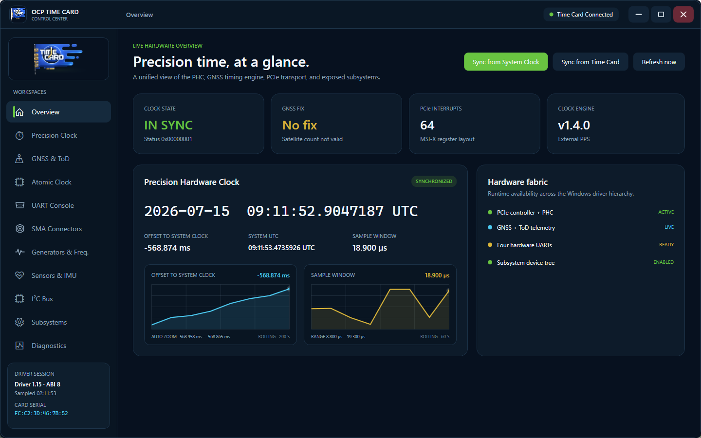

| Precision clock | GNSS and sky map | Atomic clock |
| --- | --- | --- |
| 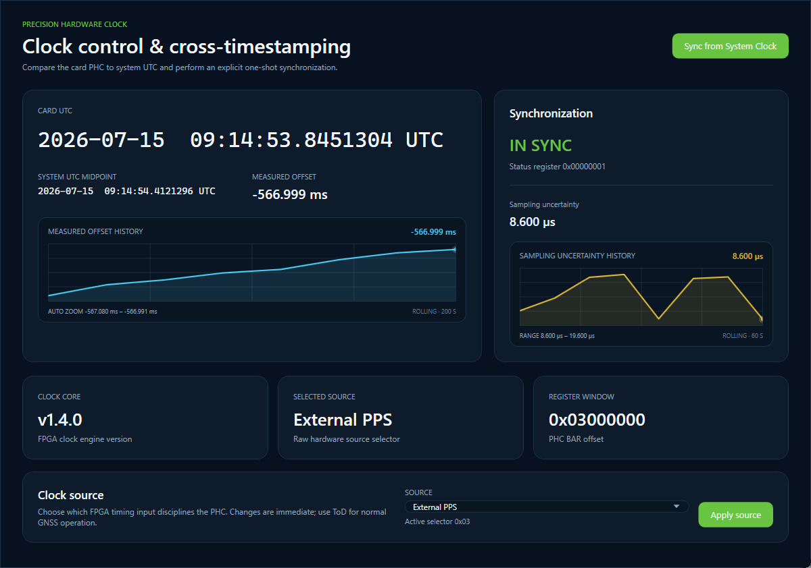 | 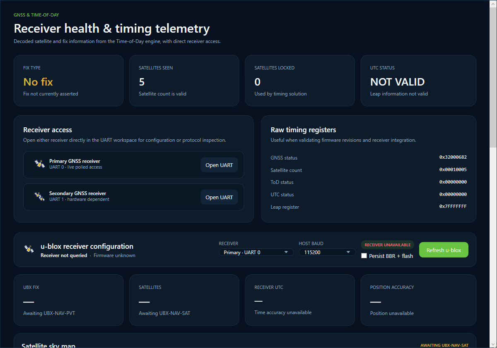 | 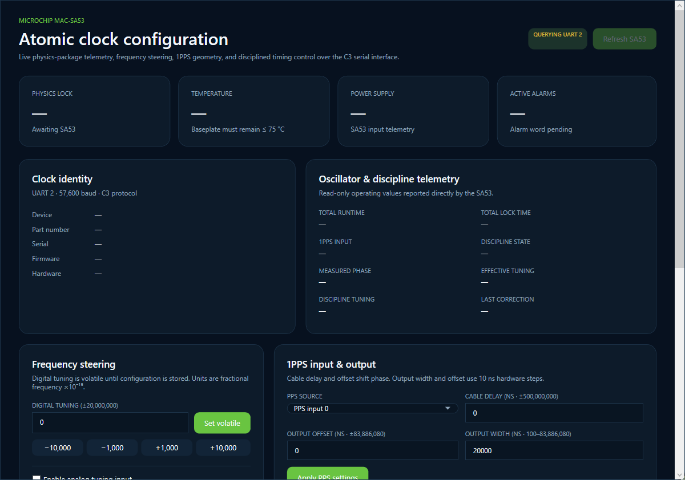 |
| UART and NMEA | SMA connectors | Generators and frequency |
| 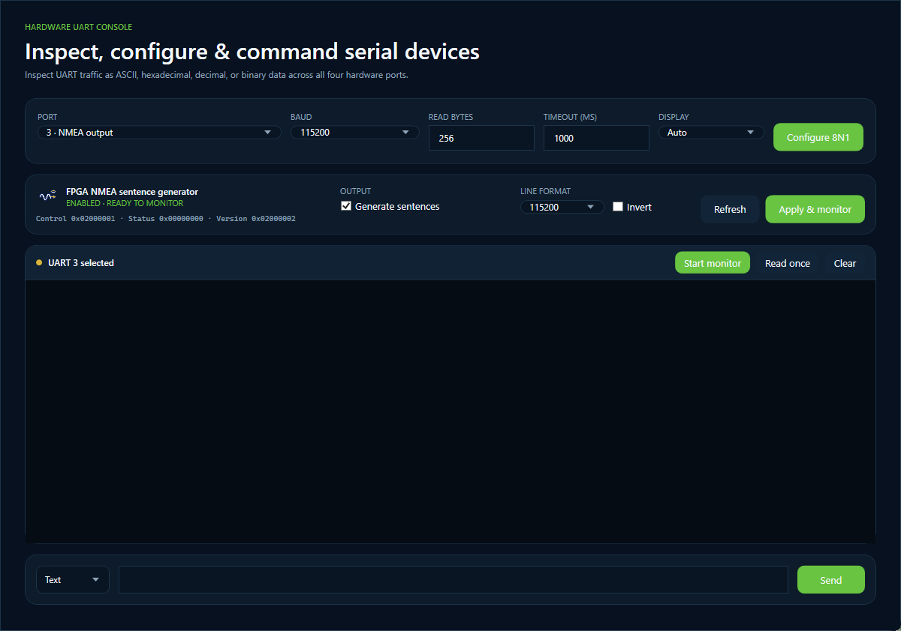 | 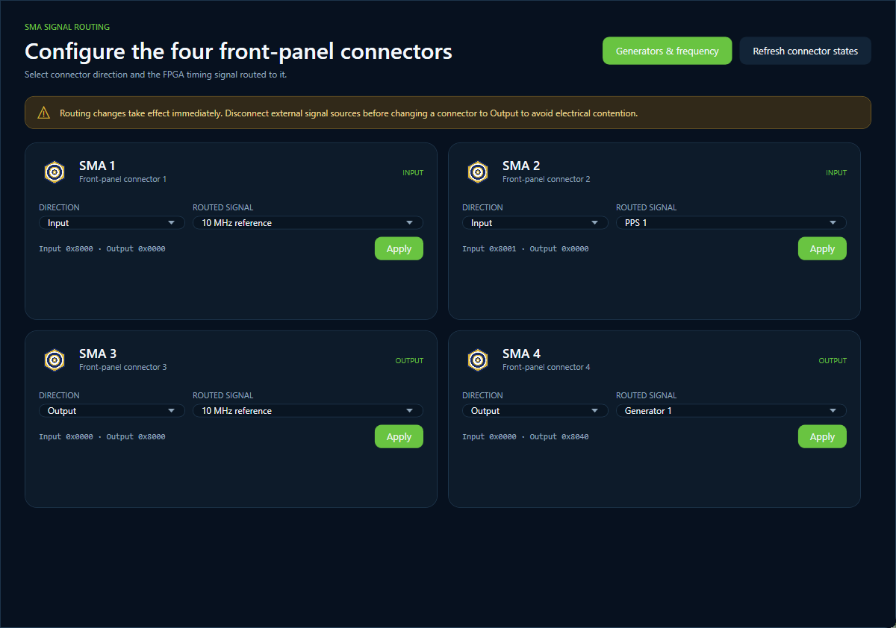 | 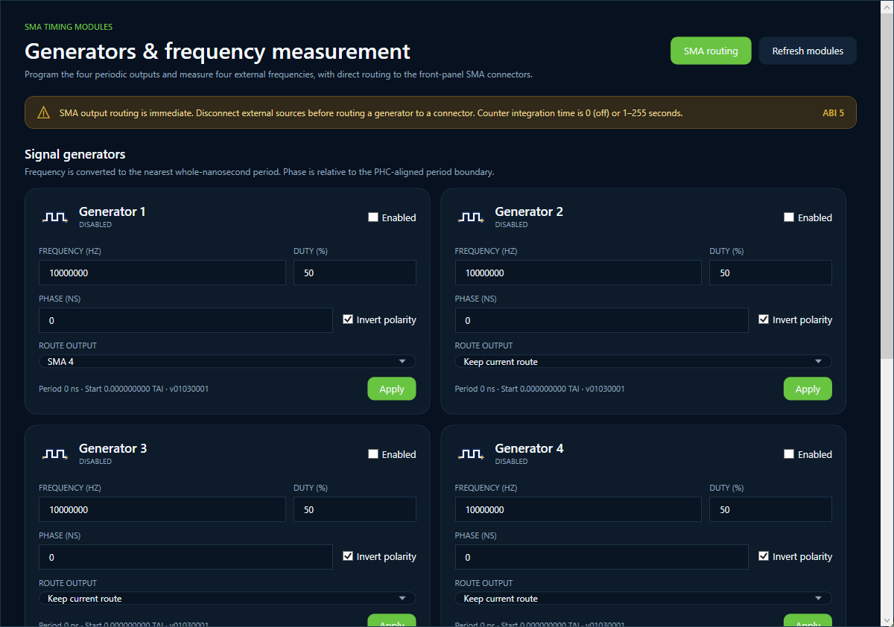 |
| Sensors and IMU | I2C and status LEDs | Subsystem map |
| 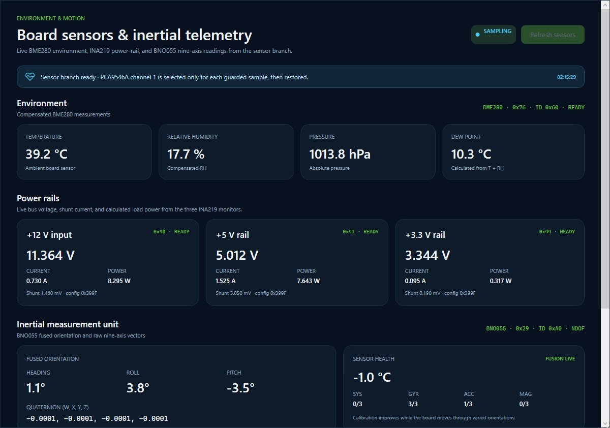 | 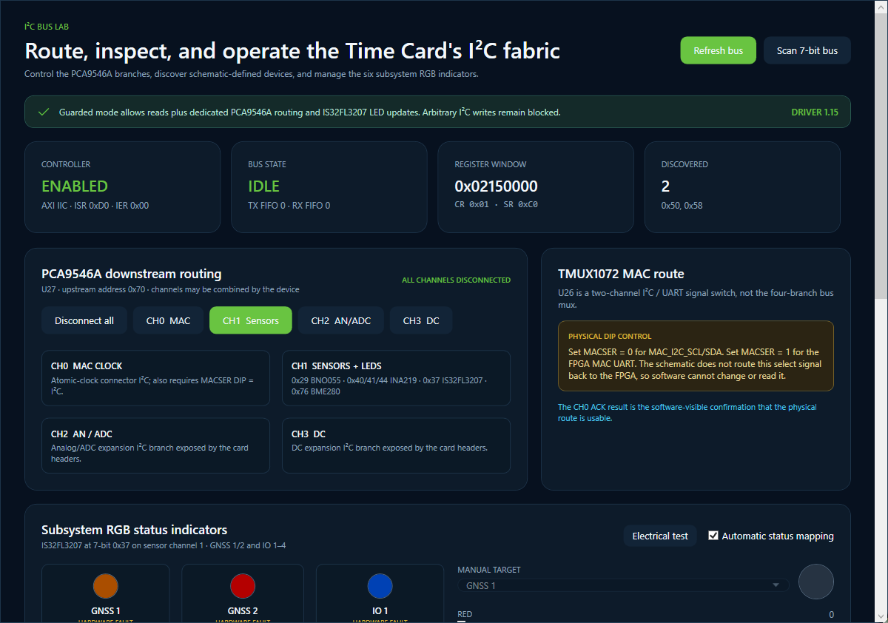 | 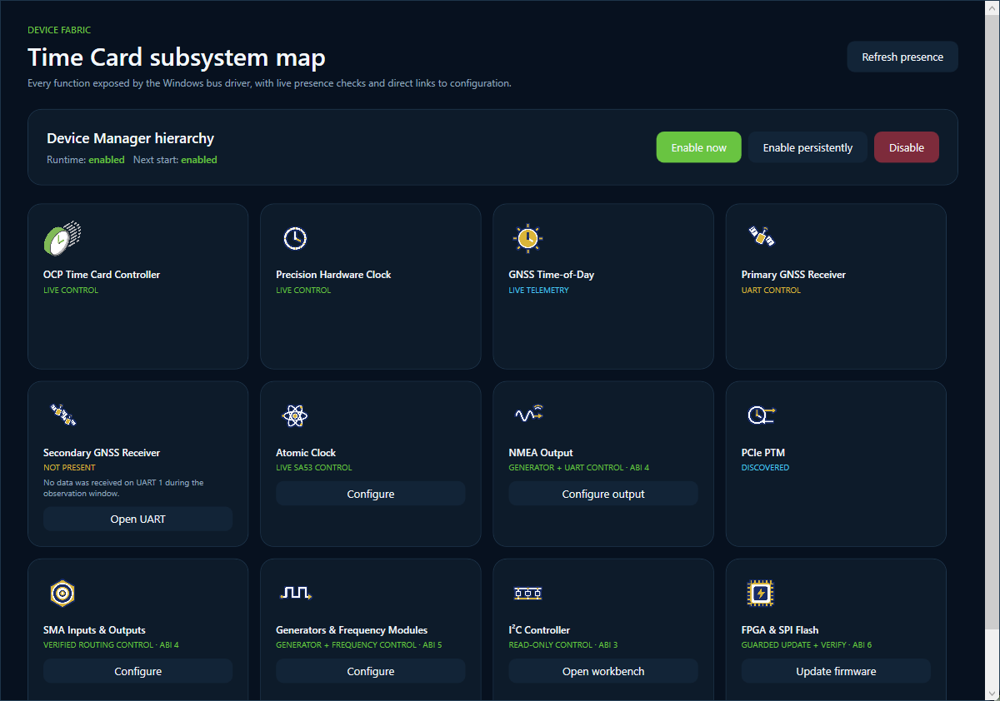 |

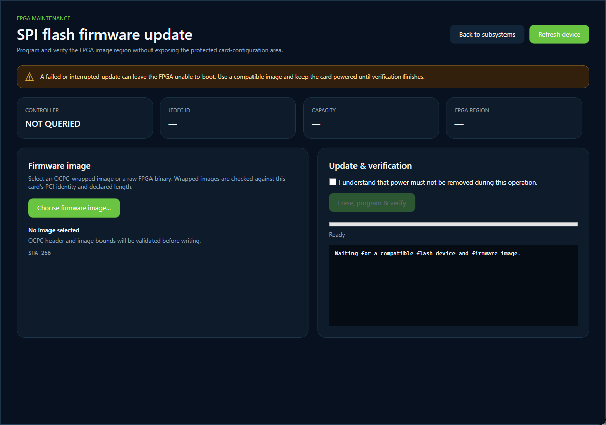

## Current capabilities

- Live PHC time, system cross-timestamp, offset, and sampling-window display,
  with rolling 200-second offset histories and 60-second uncertainty histories.
- Clock engine, synchronization, PCIe layout, BAR, interrupt status, and a
  guarded selector for all FPGA clock sources exposed by Linux `ptp_ocp`.
- Decoded GNSS fix and seen/locked satellite counts from the ToD engine.
- Direct u-blox receiver discovery and UBX telemetry, including model,
  firmware/protocol, fix, UTC, position accuracy, visible/used satellites,
  constellation counts, average carrier-to-noise level, and a vendor-style
  polar sky map with per-satellite elevation, azimuth, signal strength,
  constellation, tracking quality, and solution-use state. Compatible
  configuration-database receivers expose navigation rate and platform model,
  constellation selection, TP1 timing, and UART 1 message-rate controls.
- Guarded one-shot synchronization in both directions between system UTC and
  the Time Card PHC.
- Polled UART configuration and monitoring with Auto, ASCII, hexadecimal,
  decimal, and binary display modes, plus text or binary transmission for
  GNSS, GNSS2, atomic-clock, and NMEA ports.
- FPGA NMEA sentence-generator enable, baud, and polarity configuration with
  one-click synchronized UART monitoring.
- A dedicated Microchip MAC-SA53 workspace with live identity, physics-lock,
  alarm, temperature, supply, runtime, phase, and steering telemetry. It can
  configure digital tuning, analog-tuning mode, PPS source/offset/width/cable
  delay, discipline and phase-metering modes, loop time constants, lock
  thresholds, PPS quantization correction, and the time-of-day counter.
- Four-connector SMA routing with input/output menus, named FPGA timing
  signals, fixed-direction detection, raw-map readback, and output warnings.
- A dedicated timing workspace for four PHC-aligned periodic signal generators
  and four frequency counters, with frequency, duty, phase, polarity,
  integration-window, and direct SMA routing controls.
- A guarded I2C workbench with AXI IIC health, known-device probing, full 7-bit
  discovery, EEPROM/register presets and paging, adjustable timeout,
  hex/ASCII/decimal/binary views, decoded transaction diagnostics, the unique
  card serial, and direct PCA9546A branch routing.
- Manual and automatic control of all six IS32FL3207 RGB subsystem indicators,
  including current limiting, open/short reporting, and a bounded electrical
  test that restores the previous colors.
- Live one-hertz BME280 temperature/humidity/pressure, INA219 +12 V/+5 V/+3.3 V
  rail telemetry, and BNO055 fused orientation plus raw nine-axis IMU data.
- Runtime and persistent Device Manager subsystem-hierarchy controls.
- A guarded FPGA SPI-flash workspace with JEDEC/geometry discovery, OCPC
  vendor/device/length/CRC validation, explicit raw-image warnings, protected
  4 KiB erase and page programming, progress reporting, and full read-back
  verification.
- Copyable engineering diagnostics and an in-application session log.
- A subsystem capability map using the same artwork as Device Manager, direct
  links to NMEA and generator/frequency configuration, and a non-destructive
  UART activity check that reports GNSS2 as `NOT PRESENT` when it is silent.
- Polished startup and session behavior with an extended splash screen,
  aspect-preserving animated Time Card branding, `Time Card Connected` status,
  and a notification with one-click elevation when started as a non-admin.

## Build

Visual Studio 2022 with the managed desktop build tools and the .NET Framework
4.7.2 targeting pack is required. No NuGet packages are used.

From a regular command prompt or PowerShell window:

```powershell
cd C:\Users\Ahmad\git\Time-Card\DRV\Windows
.\build-gui.cmd release
```

The executable is written to:

```text
TimeCardControlCenter\bin\Release\TimeCardControlCenter.exe
```

## Run

The kernel device currently requires administrator access for both read and
write IOCTLs. The application opens normally so its interface and diagnostics
remain available; when access is denied, select **Restart as administrator**.

The driver and card must already be installed. The dashboard reconnects every
five seconds if the card is temporarily unavailable.

Workspaces can be opened directly for lab consoles, documentation, or test
automation:

```powershell
TimeCardControlCenter.exe --page Clock
TimeCardControlCenter.exe --page Gnss
TimeCardControlCenter.exe --page Uart --uart-port=3
TimeCardControlCenter.exe --page Sma
TimeCardControlCenter.exe --page Timing
TimeCardControlCenter.exe --page Sensors
TimeCardControlCenter.exe --page I2c
TimeCardControlCenter.exe --page Subsystems
TimeCardControlCenter.exe --page Flash
```

For repeatable documentation and visual regression checks, `--capture` renders
the selected live application window to PNG after the initial connection pass,
then exits:

```powershell
TimeCardControlCenter.exe --page Uart --uart-port=3 --capture=nmea.png
```

## UART console

Ports use the same stable numbering as the public driver ABI:

| Port | Function |
| ---: | --- |
| 0 | Primary GNSS receiver |
| 1 | Secondary GNSS receiver |
| 2 | Miniature atomic clock |
| 3 | NMEA output |

UART framing is currently 8N1. Reads and writes are limited to 256 bytes, and
timeouts are clamped to five seconds. An idle read is treated as a normal
zero-byte monitor sample rather than an application error.

The display selector can automatically choose a readable representation or
show every byte explicitly as ASCII, hexadecimal, decimal, or binary. Changing
the selection re-renders the retained console history without another read.

The UART selectors use an application-owned dark template so their selected
values, editable baud field, and dropdown entries remain readable regardless
of the active Windows theme.

Selecting UART 3 opens the NMEA generator panel. The generator and the 16550
receiver are different FPGA blocks, so configuring only the receiver cannot
make sentences appear. Driver 1.9 / ABI 4 controls both together: it enables
the generator, selects one of the Linux-supported baud rates, applies normal
or inverted polarity, configures UART 3 to the same baud, and then starts the
monitor. The driver defaults a disabled generator to 9,600 baud, matching the
Linux initialization sequence.

## Precision clock source

The **Precision Clock** workspace can select None, Time-of-Day/GNSS, IRIG-B,
external PPS, PTP, RTC, DCF77, register-controlled, or external-selector mode.
The values and register semantics match the Linux `clock_source` attribute.
Every change requires confirmation because selecting an unavailable source can
remove PHC synchronization. Time-of-Day/GNSS is the normal Time Card setting.

## Clock synchronization

The **Overview** workspace provides both synchronization directions. **Sync
from System Clock** writes the current system UTC value to the PHC. **Sync from
Time Card** reads a fresh bracketed PHC cross-timestamp and sets Windows UTC
from the card after explicit confirmation. The second operation requires
administrator privileges and is blocked when the PHC date is outside 2020 to
2100, preventing an uninitialized clock such as 1970 from replacing a valid
system time. Windows accepts this one-shot value at millisecond resolution.

The **Overview** and **Precision Clock** workspaces retain rolling 200-second
histories for measured system-clock offset. Their cross-timestamp sampling
window and uncertainty histories retain 60 seconds. Detail-focused automatic
vertical zoom follows the visible data range so small offset changes remain
easy to see without clipping larger excursions.

## u-blox GNSS configuration

The **GNSS & Time-of-Day** workspace can query a receiver on UART 0 or UART 1
using checksum-protected UBX frames. It recognizes the repository-recommended
[u-blox RCB-F9T](https://www.u-blox.com/en/product/rcb-f9t-timing-board) through
`UBX-MON-VER`, while `UBX-NAV-PVT` and `UBX-NAV-SAT` provide generic status on
many other u-blox generations. The recommended RCB-F9T normally uses UART 0 at
115,200 baud on the Time Card; the host baud selector can communicate with a
receiver at another existing baud without changing the receiver's own port
configuration.

The satellite sky map decodes every repeated `UBX-NAV-SAT` block. It uses the
standard north-up polar layout with zenith at the center and the horizon at the
outer ring. Marker color identifies the constellation, marker size follows
C/N₀, and a white outline identifies a satellite used in the navigation
solution. The adjacent scrollable signal table exposes elevation, azimuth,
C/N₀, and tracking quality for every reported satellite.

Receivers supporting `UBX-CFG-VALGET` and `UBX-CFG-VALSET` expose four
independently detected control groups:

- Measurement period, navigation ratio, time reference, and dynamic platform
  model.
- GPS, Galileo, BeiDou, GLONASS, QZSS, and SBAS constellation enables.
- TP1 enable, GNSS synchronization, locked settings, edge polarity, time grid,
  period, and pulse width.
- UBX NAV-PVT and NMEA GGA, GSA, GSV, RMC, and ZDA output rates on UART 1.

Configuration changes target receiver RAM by default and are therefore lost
at reset. Selecting **Persist BBR + flash** asks for confirmation before the
same values are written to the battery-backed and flash layers. Disabling the
time pulse, changing it away from rising-edge 1 PPS, and unusually high
navigation rates receive additional warnings because they can interrupt Time
Card synchronization or overload serial output. The application never changes
the receiver UART baud, disables UBX protocol access, resets the receiver, or
updates receiver firmware. Parameter keys, bounds, frame formats, and ACK/NAK
handling follow the official
[RCB-F9T Interface Description](https://content.u-blox.com/sites/default/files/RCB-F9T_InterfaceDescription_%28UBX-19003606%29.pdf).

## Microchip MAC-SA53 atomic clock

The **Atomic Clock** workspace talks directly to UART 2 using Microchip's C3
protocol at the factory-default 57,600 baud, 8N1. It uses the documented
MAC-SA5X parameter names and bounds from the
[MAC-SA5X User's Guide](https://ww1.microchip.com/downloads/aemDocuments/documents/FTD/ProductDocuments/UserGuides/Miniature-Atomic-Clock-MAC-SA5X-Users-Guide-DS50002938.pdf).
The general UART monitor is stopped before an SA53 transaction and the complete
command/response exchange is serialized so monitor reads cannot consume C3
responses.

Digital tuning and discipline settings take effect immediately. Enabling PPS
disciplining can initiate a JamSync and move the 1PPS phase; the application
therefore asks for confirmation. Analog tuning cannot be enabled from the UI
while digital tuning is nonzero or PPS disciplining is selected. PPS
disciplining and phase metering are also enforced as mutually exclusive.

Alarm acknowledgement sends the current active alarm bitmask and does not hide
the underlying alarm condition. JamSync, loading stored settings, and writing
configuration to flash each require confirmation. Calibration latching, CPU
reset, and serial-baud changes are intentionally unavailable because they can
be irreversible or interrupt communication.

## SMA connector control

The bounded SMA query and set operations are modeled on Linux `ptp_ocp`. The
application exposes named 10 MHz, PPS, timestamp, frequency, IRIG-B, DCF77,
GNSS, PHC, atomic-clock, and generator routes; it does not permit arbitrary
MMIO writes. Firmware with fixed connector directions is detected and the
direction menu is locked accordingly. Driver 1.9 fixes fixed-direction routing
by never clearing the absent opposite map and verifies every applied route by
immediate register readback.

Routing changes are immediate. Disconnect externally driven equipment before
changing a connector to output. The application asks for confirmation before
applying any output route.

## Generators and frequency counters

Driver 1.10 / ABI 5 exposes four bounded periodic-output modules and four
frequency counters without permitting arbitrary MMIO. Each generator accepts
a frequency, 1–99% duty cycle, phase in nanoseconds, and polarity. The driver
converts these into period and pulse widths, schedules the next start against
the PHC, and applies the same disable/program/enable sequence used by Linux
`ptp_ocp`. A generator can be routed directly to any compatible SMA output.

Each frequency counter accepts an integration window of 0 (disabled) or
1–255 seconds. The workspace decodes valid, error, and overrun states and can
route any front-panel SMA input to `FREQ1` through `FREQ4`.

## I2C workbench

Driver ABI 3 adds bounded Xilinx AXI IIC status, address-only probe, and read
operations using the register layout and transfer flow used by Linux
`i2c-xiic`. The application recognizes the board 24C02 EEPROM at `0x50` and
the 24MAC402 identity EEPROM at `0x58`, can scan all normal 7-bit addresses,
and displays reads as hex plus ASCII, hex, ASCII, decimal, or binary. Presets,
previous/next page navigation, a 50/100/250 ms timeout selector, copy, an ACK
map, and decoded control/status/interrupt flags support bus diagnosis. The six
bytes in the factory EUI-48 area at raw offset `0x9a` are formatted as the
card's unique serial number. Linux exposes the same identity bytes at NVMEM
offset zero through the `24mac402` provider to `ptp_ocp`'s `serialnum`
attribute.

Reads support no subaddress or a one- or two-byte subaddress followed by a
repeated start. Transfers are limited to 255 bytes and a bounded timeout.
Driver 1.14 corrects the dynamic-mode startup handshake by queuing the complete
command before clearing the stale bus-not-busy latch, matching Linux
`i2c-xiic`. Receive data is drained whenever available,
the expected final receive NACK is handled separately from an address NACK,
and a failed transient transaction is reset and retried once. Native Win32
error text and a post-failure controller snapshot are shown if a read still
fails. The Control Center requires driver 1.14 or newer for I2C operations.

Driver 1.14 / ABI 7 provides dedicated controls for the schematic's U27 PCA9546A
at `0x70`. Channel 0 is the MAC-clock branch, channel 1 contains the onboard
sensors and RGB LED driver, channel 2 is the analog/ADC expansion branch, and
channel 3 is the DC expansion branch. The workspace shows the selected mask,
offers safe single-branch shortcuts, annotates full scans with the expected
BNO055, INA219, BME280, and IS32FL3207 addresses, and provides matching read
presets.

U26, the TMUX1072 near the MAC connector, is controlled by the physical
`MACSER` DIP only; the select net is not routed to the FPGA. The workspace
therefore explains that channel 0 also requires `MACSER=0` instead of exposing
a non-functional software toggle.

The IS32FL3207 uses 7-bit address `0x37`; the schematic's `0x6e` label is its
8-bit write address. It drives six common-anode RGB indicators: GNSS1 uses
OUT1–3, GNSS2 OUT4–6, and IO1 through IO4 use OUT7–18 in groups of three.
Manual RGB/current controls and automatic status mapping are available.
Automatic mode uses green for a GNSS fix or configured SMA output, blue for an
SMA input, amber for searching/unknown/disabled states, and red for missing or
failed status. LED transactions temporarily select sensor channel 1 and then
restore the user's PCA9546A mask. The driver caps global current at 128 and
does not expose a general data-write or EEPROM-programming IOCTL.

The Electrical test button saves the six colors, verifies that the hardware
SDB pin permits a device reset, bypasses PWM, and forces all 18 current sinks
on for five seconds before restoring the saved state. Open/short results are
shown in the workspace, and automatic mapping marks affected packages as
`HARDWARE FAULT` instead of reporting a successful visible update.

## Sensors and IMU

Driver 1.15.1 / ABI 8 and the dedicated Sensors & IMU workspace read every
populated monitor on the schematic's sensor branch. The BME280 cards show
factory-compensated temperature, relative humidity, pressure, and calculated
dew point. The three INA219 cards show bus voltage, shunt current, and load
power for +12 V, +5 V, and +3.3 V using the board's 2 milliohm shunts.

The BNO055 is placed in NDOF fusion mode and uses the V9 schematic's external
32.768 kHz crystal. The workspace reports heading, roll, pitch, quaternion,
temperature, calibration levels, acceleration, linear acceleration, gravity,
angular velocity, and magnetic field. Sampling is live at one hertz while the
workspace is visible. Each query temporarily selects PCA9546A channel 1,
reports missing devices separately, and restores the previous mux selection.

## FPGA SPI flash

Driver 1.12 / ABI 6 exposes only the FPGA firmware portion of SPI-NOR. The
configuration area below physical offset `0x00400000` cannot be addressed by
the public IOCTLs. Erases are fixed to aligned 4 KiB sectors, programs cannot
cross the reported 256-byte page boundary, and reads/programs are limited to
256 bytes per request.

The workspace accepts the `OCPC` wrapper used by Linux `ptp_ocp`; it verifies
the PCI identity (`1D9B:0400`), declared payload length, and CRC16 before
stripping the wrapper. Raw images are allowed only with a prominent warning
and the same explicit acknowledgement as wrapped images. An update erases the
required sectors, programs every page, then reads and compares every payload
byte. Closing the application is blocked while this operation runs. Keep the
card powered throughout and power-cycle it only after verification succeeds.

## Driver API roadmap

The current ABI deliberately does not expose arbitrary register writes for
SMA polarity/calibration, I2C data writes, the protected flash configuration
region, or PTM.
Those controls should be enabled only after dedicated, validated kernel IOCTLs
are added using the Linux driver behavior as the reference.
